# Network Customisation

P52 MAC
E8:6A:64:5D:2E:8A
Prev Address Resvn 192.168.1.191 ( for z/OS )

## Home Network Diagram

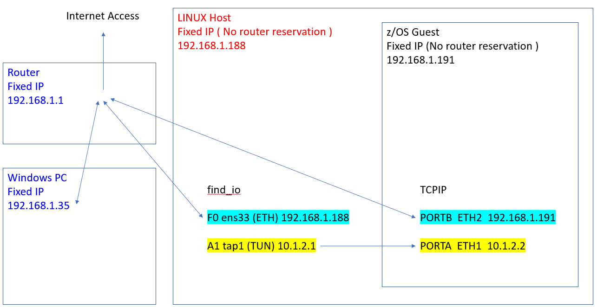

## Find_IO

As ibmsys1, issue the find_io command
None of the tunnel devices have IP addresses or subnets defined at this point.


```  
FIND_IO for "ibmsys1@localhost.localdomain" 

         Interface         Current          MAC                IPv4              IPv6           
 Path    Name              State            Address            Address           Address        
------   ----------------  ---------------- -----------------  ----------------  -------------- 
  F0     enp0s31f6         UP, RUNNING      e8:6a:64:5d:2e:8a  192.168.1.188     fe80::8124:21fd:e178:6d63%enp0s31f6  
  F1     wlp0s20f3         DOWN             fa:f4:36:d4:cd:1d  *                 *               
. 
  *      virbr0            UP, NOT-RUNNING  52:54:00:a4:96:d1  192.168.122.1     *               
  *      virbr0-nic        DOWN             52:54:00:a4:96:d1  *                 *               
. 
  A0     tap0              DOWN             02:a0:a0:a0:a0:a0  *                 *               
  A1     tap1              DOWN             02:a1:a1:a1:a1:a1  *                 *               
  A2     tap2              DOWN             02:a2:a2:a2:a2:a2  *                 *               
  A3     tap3              DOWN             02:a3:a3:a3:a3:a3  *                 *               
  A4     tap4              DOWN             02:a4:a4:a4:a4:a4  *                 *               
  A5     tap5              DOWN             02:a5:a5:a5:a5:a5  *                 *               
  A6     tap6              DOWN             02:a6:a6:a6:a6:a6  *                 *               
  A7     tap7              DOWN             02:a7:a7:a7:a7:a7  *                 *
```  
  
## Edit devmapz25a.txt

Ensure that the devicemap includes a general OSA and a tunnel OSA.
We want to map the general OSA to Path F0 ( enp0s31f6 : the ethernet adapter on the host linux-intel system).
We want to map the tunnel OSA to one of the tunnel adapters ( we'll pick tap1 on path A1 )
```
[manager]  # tap define network adapter (OSA) for communication with Linux
name awsosa 0024 --path=A1 --pathtype=OSD --tunnel_intf=y   # QDIO mode
device 400 osa osa --unitadd=0
device 401 osa osa --unitadd=1
device 402 osa osa --unitadd=2

[manager]  # OSA define OSA for general network communication
name awsosa 0022 --path=F0 --pathtype=OSD
device 404 osa osa
device 405 osa osa
device 406 osa osa
```

We will use the ZPDT default subnet masks for tunnel adapters.
The --tunnel_ip and --tunnel_mask defaults are as follows: 

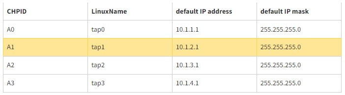


## IPL z/OS after the devmap changes

Issue the find_io command again
TAP1 is now active on path A1

```
 FIND_IO for "ibmsys1@localhost.localdomain"

         Interface         Current          MAC                IPv4              IPv6
 Path    Name              State            Address            Address           Address
------   ----------------  ---------------- -----------------  ----------------  --------------
  F0     enp0s31f6         UP, RUNNING      e8:6a:64:5d:2e:8a  192.168.1.188     fe80::8124:21fd:e178:6d63%enp0s31f6
  F1     wlp0s20f3         DOWN             32:7a:7c:34:8f:48  *                 *
.
  *      virbr0            UP, NOT-RUNNING  52:54:00:a4:96:d1  192.168.122.1     *
  *      virbr0-nic        DOWN             52:54:00:a4:96:d1  *                 *
.
  A0     tap0              DOWN             02:a0:a0:a0:a0:a0  *                 *
  A1     tap1              UP, RUNNING      8a:f2:d8:a5:b1:a7  10.1.2.1          fe80::88f2:d8ff:fea5:b1a7%tap1
  A2     tap2              DOWN             02:a2:a2:a2:a2:a2  *                 *
  A3     tap3              DOWN             02:a3:a3:a3:a3:a3  *                 *
  A4     tap4              DOWN             02:a4:a4:a4:a4:a4  *                 *
  A5     tap5              DOWN             02:a5:a5:a5:a5:a5  *                 *
  A6     tap6              DOWN             02:a6:a6:a6:a6:a6  *                 *
  A7     tap7              DOWN             02:a7:a7:a7:a7:a7  *                 *


         Interface                         Current Settings
 Path    Name              RxChkSum      TSO     GSO     GRO     LRO    RX VLAN       MTU**
------   ----------------  ---------------- -----------------  ----------------  --------------
  F0     enp0s31f6           On*         On*     On*     On*     Off      On*         1500
  F1     wlp0s20f3           Off         Off     On*     On*     Off      Off         1500
.
  *      virbr0              Off         On*     On*     On*     Off      Off         1500
  *      virbr0-nic          Off         Off     On*     On*     Off      Off         1500
.
  A1     tap1                Off         Off     On*     On*     Off      Off         1500
```

## z/OS TCPIP Definitions

Review **ADCD.Z25A.VTAMLST(OSATRL2)** and note port names (used in later instructions):

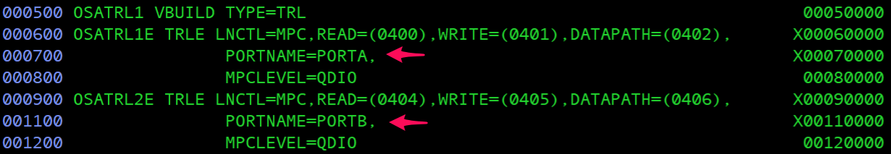

Update **ADCD.Z25A.TCPPARMS(ZPDTDEV2)** to access z/OS and Linux via a tunnel:
- The IP address used to access z/OS from Linux (via tunnel) is 10.1.2.1
- The IP address used to access Linux from z/OS (via tunnel) is 10.1.2.2
- The IP address used by z/OS is 192.168.1.191

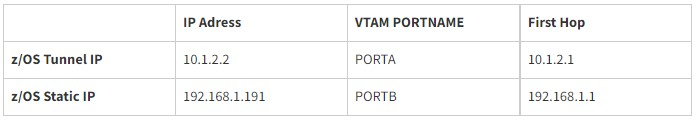

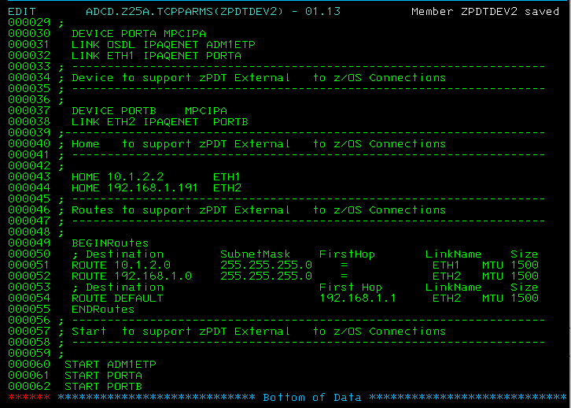

Edit member **ADCD.Z25A.TCPPARMS(PROF2)** and update the ZPDT External parm:
- comment out adcd.Z25A.tcpparms(zpdtdev1)
- Add entry for user.Z25A.tcpparms(zpdtdev2)

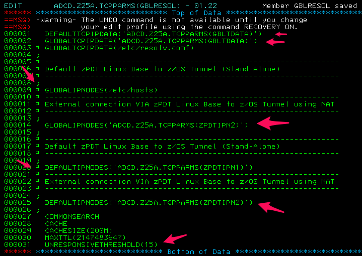


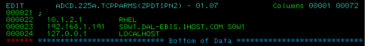


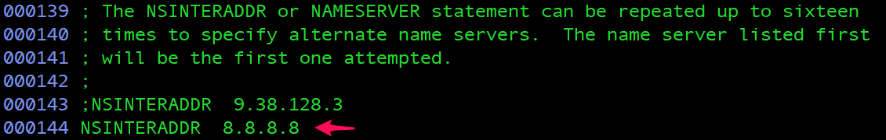


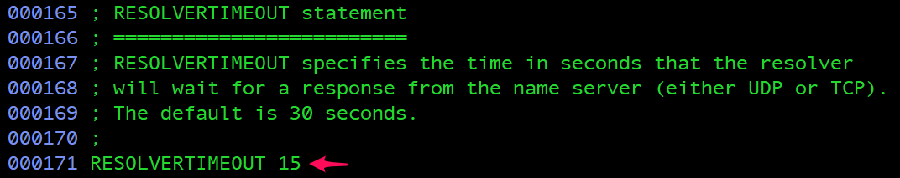


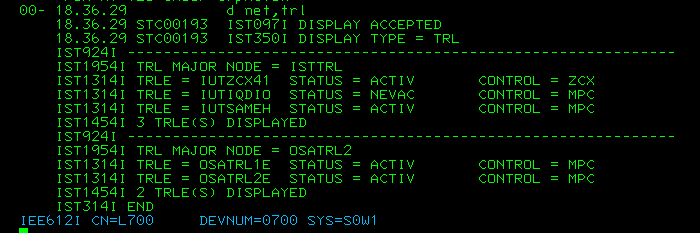


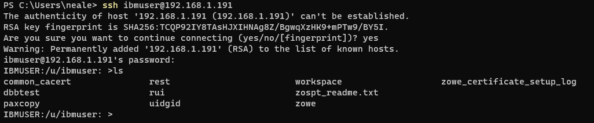


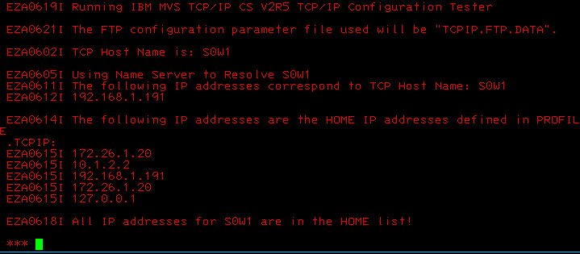

