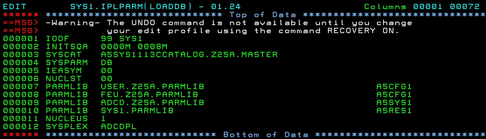

# Basic Customisations.

## IPL

firstipl.sh 
awsckmap devmap.txt
awsstart --map devmap.txt
x3270 -port 3270 mstcon@localhost &
x3270 -port 3270 tso@localhost &
ipl 0a80 parm 0A82CS

Respond to Master Console Prompts with **r 0,i** on first IPL


## Logon

IBMUSER ( IBMUSER )
Change PWD to ( SYS1 )
Logn Proc DBSPROCC


## Clock

Set the Clock .... Edit ADCD.Z24C.PARMLIB because the USER.Z24C.PARMLIB concatenation does NOT work

Member **IEASYSDB** and **IASSYSAL** both point to CLOCK00


Set the clock to Sydney by editing **ADCD.Z25A.PARMLIB(CLOCK00)**


## PARMLIB and PROCLIB Concatenations

Parmlib concatenations for the DB IPL Parm defined in **SYS1.IPLPARM(LOADDB)**



Proclib Concatenation defined in **ADCD.Z25A.PARMLIB(MSTJCL00)**


## IPL and Shutdown Controls

IPL startup procedures defined in **ADCD.Z25A.PARMLIB(VTAMDB)** and **ADCD.Z25A.PARMLIB(VTAMALL)** etc...

```
COMMANDPREFIX=NONE   /* THIS IS THE DEFAULT VALUE */                   
PAUSE 10      /* WAIT FOR SYS TO GET UP FIRST  */                      
S RRS,SUB=MSTR,GNAME=&SYSNAME                                          
S TSO         /* TIME SHARING OPTION */                                
S SDSF                                                                 
S EZAZSSI,P=S0W1                                                       
S TCPIP                                                                
PAUSE 5                                                                
S TN3270                                                               
PAUSE 5                                                                
/* S INETD */                                                          
PAUSE 10                                                               
/*---------------------- DB2 V12 -------------------------------------*
-DBCG START DB2                                                        
PAUSE 10                                                               
S HTTPD1                                                               
S NFSS                                                                 
S CSF                                                                  
S HZSPROC                                                              
PAUSE 5                                                                
S SSHD                                                                 
%CSQ9 START QMGR                                                       
PAUSE 15                                                               
%CSQ9 START CHINIT                                                     
S ASCH,SUB=MSTR                                                        
PAUSE 5                                                                
S JMON                                                                 
PAUSE 3                                                                
S RSED                                                                 
S RSEAPI                                                               
PAUSE 3                                                                
S CFZCIM                                                               
PAUSE 10                                                               
/* S IZUANG1    */   
/* S IZUSVR1    */                                     
D T                          /* DISPLAY ENDING TIME    
* COMMENT LINES MAY ALSO START WITH A SINGLE ASTERISK. 
* REMEMBER - BLANK LINES ARE A BIG NO-NO.              
```

Must Add
```
S ZOSCSRV
S FTPD   
S INETD  
```


And for Shutdown, edit **ADCD.Z25A.PARMLIB(SHUTALL)** and **ADCD.Z25A.PARMLIB(SHUTDB)**

Must Add
```
P INETD  
P FTPD   
P ZOSCSRV
```

## Extra Volumes

USERXX volumes - mod 27s - allocate with **smspool.sh** 

```
alcckd /home/ibmsys1/Z25A001/USER0A -d3390-27
alcckd /home/ibmsys1/Z25A001/USER0B -d3390-27
alcckd /home/ibmsys1/Z25A001/USER0C -d3390-27
alcckd /home/ibmsys1/Z25A001/USER0D -d3390-27

```

EAVXXX volumes - mod 9s for SMPE - allocate with **eavpool.sh**

```
alcckd /home/ibmsys1/Z25A001/EAV00A -d3390-9
alcckd /home/ibmsys1/Z25A001/EAV00B -d3390-9
alcckd /home/ibmsys1/Z25A001/EAV00C -d3390-9
alcckd /home/ibmsys1/Z25A001/EAV00D -d3390-9
alcckd /home/ibmsys1/Z25A001/EAV00E -d3390-9
alcckd /home/ibmsys1/Z25A001/EAV00F -d3390-9
```

ZCXXXX volumes - mod 27s - allocate with **zcxpool.sh** 

```
alcckd /home/ibmsys1/Z25A001/ZCX00A -d3390-27
alcckd /home/ibmsys1/Z25A001/ZCX00B -d3390-27
alcckd /home/ibmsys1/Z25A001/ZCX00C -d3390-27
alcckd /home/ibmsys1/Z25A001/ZCX00D -d3390-27
```

Esoteric Devices - mod 27 - allocate with **esopool.sh** 

```
alcckd /home/ibmsys1/Z25A001/WORK01 -d3390-27
```


devmap
device 0600 3390 3390 /run/media/neale/NUCZPDT/Z24C001/WORK01


```
# Neale Devmap for ZDT V13.0 created 20210303
# Volume directory: /home/ibmsys1/Z25A001

[system]
memory      26000m          # define storage size for virtual host
processors  8               # number of processors
3270port    3270            # port number for TN3270 connections

[manager]
name aws3274 0002           # define a few 3270 terminals
device 0700 3279 3274 mstcon
device 0701 3279 3274 tso1
device 0702 3279 3274 tso2
device 0703 3279 3274 tso3
device 0704 3279 3274 tso4

# [manager]
# name awsrdr 010C           # define a card reader for job submission
# device 00C 2540 2821 /home/ibmsys1/ZDT1204/../cards/*

[manager]  # tap define network adapter (OSA) for communication with Linux
name awsosa 0024 --path=A1 --pathtype=OSD --tunnel_intf=y   # QDIO mode
device 400 osa osa --unitadd=0
device 401 osa osa --unitadd=1
device 402 osa osa --unitadd=2

[manager]  # OSA define OSA for general network communication
name awsosa 0022 --path=F0 --pathtype=OSD 
device 404 osa osa  
device 405 osa osa  
device 406 osa osa  

[manager]
name awsckd 0001
device 0A80 3390 3390 /home/ibmsys1/Z25A001/A5RES1
device 0A81 3390 3390 /home/ibmsys1/Z25A001/A5BLZ1
device 0A82 3390 3390 /home/ibmsys1/Z25A001/A5SYS1
device 0A83 3390 3390 /home/ibmsys1/Z25A001/A5C560
device 0A84 3390 3390 /home/ibmsys1/Z25A001/A5C551
device 0A85 3390 3390 /home/ibmsys1/Z25A001/A5CFG1

device 0A86 3390 3390 /home/ibmsys1/Z25A001/A5DBAR
device 0A87 3390 3390 /home/ibmsys1/Z25A001/A5USS3
device 0A88 3390 3390 /home/ibmsys1/Z25A001/A5PRD5
device 0A89 3390 3390 /home/ibmsys1/Z25A001/A5DBC1
device 0A8A 3390 3390 /home/ibmsys1/Z25A001/A5DBC2

device 0A8B 3390 3390 /home/ibmsys1/Z25A001/A5DIS1
device 0A8C 3390 3390 /home/ibmsys1/Z25A001/A5DIS2
device 0A8D 3390 3390 /home/ibmsys1/Z25A001/A5DIS3

device 0A8F 3390 3390 /home/ibmsys1/Z25A001/A5IMF1
device 0A90 3390 3390 /home/ibmsys1/Z25A001/A5INM1
device 0A91 3390 3390 /home/ibmsys1/Z25A001/A5KAN1

device 0A92 3390 3390 /home/ibmsys1/Z25A001/A5PAGA
device 0A93 3390 3390 /home/ibmsys1/Z25A001/A5PAGB
device 0A94 3390 3390 /home/ibmsys1/Z25A001/A5PAGC

device 0A95 3390 3390 /home/ibmsys1/Z25A001/A5PRD1
device 0A96 3390 3390 /home/ibmsys1/Z25A001/A5PRD2
device 0A97 3390 3390 /home/ibmsys1/Z25A001/A5PRD3
device 0A98 3390 3390 /home/ibmsys1/Z25A001/A5PRD4

device 0A99 3390 3390 /home/ibmsys1/Z25A001/A5RES2
device 0A9A 3390 3390 /home/ibmsys1/Z25A001/A5USR1
device 0A9B 3390 3390 /home/ibmsys1/Z25A001/A5USS1
device 0A9C 3390 3390 /home/ibmsys1/Z25A001/A5USS2
device 0A9D 3390 3390 /home/ibmsys1/Z25A001/A5W901
device 0A9E 3390 3390 /home/ibmsys1/Z25A001/A5W902
device 0A9F 3390 3390 /home/ibmsys1/Z25A001/A5ZWE1 

device 0AA0 3390 3390 /home/ibmsys1/Z25A001/A5PRD1
device 0AA1 3390 3390 /home/ibmsys1/Z25A001/A5PRD2
device 0AA2 3390 3390 /home/ibmsys1/Z25A001/A5PRD3
device 0AA3 3390 3390 /home/ibmsys1/Z25A001/A5PRD4


device 0AA0 3390 3390 /home/ibmsys1/Z25A001/USER0A
device 0AA1 3390 3390 /home/ibmsys1/Z25A001/USER0B
device 0AA2 3390 3390 /home/ibmsys1/Z25A001/USER0C
device 0AA3 3390 3390 /home/ibmsys1/Z25A001/USER0D

device 0AA4 3390 3390 /home/ibmsys1/Z25A001/ZCX00A
device 0AA5 3390 3390 /home/ibmsys1/Z25A001/ZCX00B
device 0AA6 3390 3390 /home/ibmsys1/Z25A001/ZCX00C
device 0AA7 3390 3390 /home/ibmsys1/Z25A001/ZCX00D

device 0AA8 3390 3390 /home/ibmsys1/Z25A001/EAV00A
device 0AA9 3390 3390 /home/ibmsys1/Z25A001/EAV00B
device 0AAA 3390 3390 /home/ibmsys1/Z25A001/EAV00C
device 0AAB 3390 3390 /home/ibmsys1/Z25A001/EAV00D
device 0AAC 3390 3390 /home/ibmsys1/Z25A001/EAV00C
device 0AAD 3390 3390 /home/ibmsys1/Z25A001/EAV00D

device 0600 3390 3390 /home/ibmsys1/Z25A001/WORK01


```


IPL

Edit ADCD.Z24C.PARMLIB(VATLSTDB)
Edit ADCD.Z24C.PARMLIB(VATLST00)

