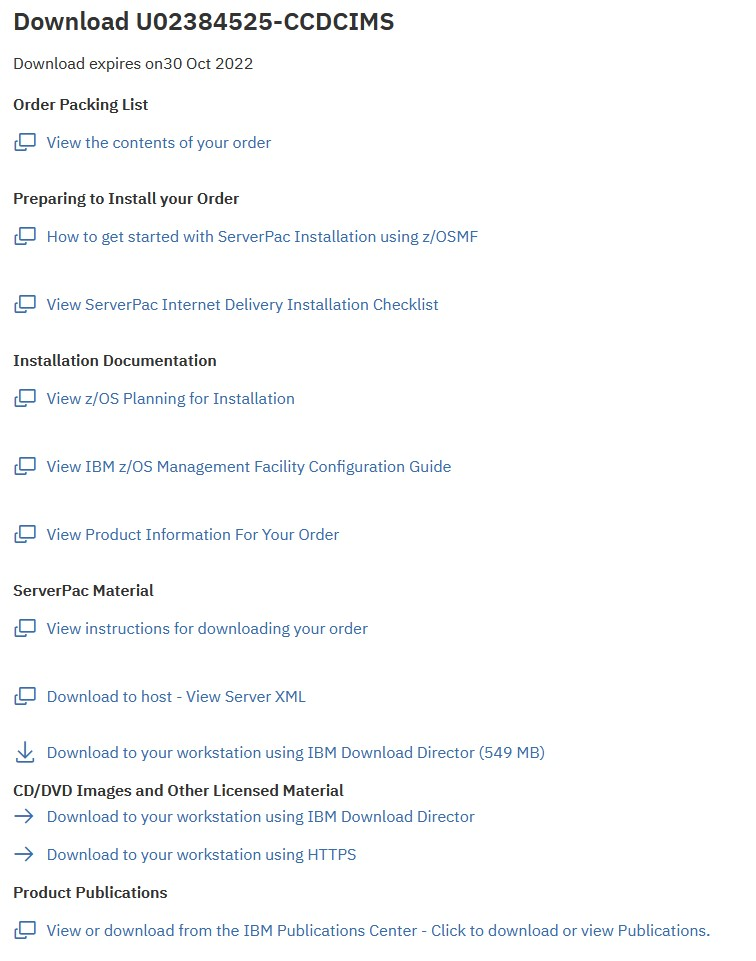

# ShopZ Usage.

## ShopZ Access

logon with IBM userid and password.
order Serverpacs ( which will tend to be portable software instances now )
Downloads must be performed using secure methods ( https or ftps )
RACF certificates and keyrings must be used, and they must be valid
z/OSMF must be setup correctly to use certificates

## RACF Certificates

Two certificates
1. Trust ShopZ certificate - to download from Download Server
2. z/OSMF certificate - for z/OSMF to behave securely

### ShopZ Trust

Given a copy by Andrew.

S:\ZSHOP\TLS\digicert.global.root.ca.cert
LABEL 'DIGITAL GLOBAL ROOT CA'


Tried to Add it, but found it's already there

```
RACDCERT ID(IBMUSER) ADDRING(SHOPZ)
RACFDCERT LISTRING(SHOPZ)
RACDCERT ADD('IBMUSER.SHOPZCRT') CERTAUTH TRUST WITHLABEL ('IBMSHOPZ')
RACDCERT ID(IBMUSER) CONNECT(CERTAUTH LABEL('IBMSHOPZ') RING((SHOPZ) USAGE(CERTAUTH) DEFAULT)
```

Not quit sure how the TTLERules later on worked, but I assume this certificate is a SITE CA Trust or something similar.

### z/OSMF Certificate

Stumbled across problems when performing a portable software instance installation, getting errors during z/OSMF workflow. 

```
IZUG1040E A secure connection to system "S0W1" could not be established.
```

Also noticed that the browser was not establishing a secure connection. This was not a problem in the basic dialogs, 
but probably was a problem when the z/OSMF PSI dialog tried to access another zOSMF service. 
z/OSMF ADCD Z25A had an expired certificate for use with ShopZ ... DOH !

```
RACDCERT CERTAUTH LIST(LABEL('zOSMFCA'))
Digital certificate information for CERTAUTH:
  Label: zOSMFCA
  Certificate ID: 2QiJmZmDhZmjganW4tTGw8FA
  Status: TRUST
  Start Date: 2013/11/18 16:00:00
  End Date:   2021/08/21 15:59:59
  Serial Number:
       >00<
  Issuer's Name:
       >CN=z/OSMF CertAuth for Security Domain.OU=IZUDFLT<
  Subject's Name:
       >CN=z/OSMF CertAuth for Security Domain.OU=IZUDFLT<
  Signing Algorithm: sha1RSA
  Key Usage: CERTSIGN
  Key Type: RSA
  Key Size: 1024
  Private Key: YES
  Certificate Fingerprint (SHA256):
       A3:F2:E0:6F:09:94:E4:9D:68:00:48:8F:3F:4B:EF:9F:
       9F:C8:B1:50:0A:de:57:23:AB:DC:B1:02:0B:A4:33:07
  Ring Associations:
    Ring Owner: IZUSVR
    Ring:
       >IZUKeyring.IZUDFLT<
    Ring Owner: START1
    Ring:
       >JES2EDS<
```

Expired certificates can't be renewed / extended. ( you need to do that before expirey ).


Finally remote the "not secure" error in the browser by replacing the IP Address with a hostname .

```
SSL_BAD_CERT_DOMAIN

https://192.168.1.191:10443/zosmf/ 
```


#### Setup new certificate etc...

Step 1 : Generate new self signed CA certificate , certificate & refresh RACF.


```
racdcert certauth gencert subjectsdn(cn('zOSMF CA 2') o('IBM') c('AU')) 
size(2048) withlabel('zOSMFCA2') notafter(date(2031-12-31))

racdcert id(izusvr) gencert subjectsdn(cn('zOSMF Server 2') o('IBM')
c('AU')) size(2048) withlabel('zOSMFServer2') notafter(date(2031-12-31))
signwith(certauth label('zOSMFCA2'))

setr raclist(digtcert) refr
```

Step 2 : Plonk them in a keyring

```
racdcert addring(zOSMFRing2) id(izusvr)

racdcert connect(ring(zOSMFRing2) certauth label('zOSMFCA2')) id(izusvr)

racdcert connect(ring(zOSMFRing2) id(izusvr) label('zOSMFServer2')
default) id(izusvr)

racdcert listring(zOSMFRing2) id(izusvr)
```

Step 3 : update z/OSMF config to refer to the new keyring

Find out that ZUSVR1 invokes PARMLIB member AS (from SDSF output)

```
**************** TOP OF DATA ****************************
      J E S 2  J O B  L O G  --  S Y S T E M  S 0 W 1  --
                                                         
 ---- SATURDAY,  08 OCT 2022 ----                        
  $HASP373 IZUSVR1  STARTED                              
  IEF403I IZUSVR1 - STARTED - TIME=09.47.08              
  +IEE252I MEMBER IZUPRMAS FOUND IN FEU.Z25A.PARMLIB     
  +CWWKE0001I: The server zosmfServer has been launched. 
```

Edit IZUPRMAS ( in both ADCD and FEU Proclibs )
* ADCD.Z25A.PARMLIB(IZUPRMAS)
* FEU.Z25A.PARMLIB(IZUPRMAS)

```
KEYRING_NAME('zOSMFRing2')
```

Start z/OSMF with manual override on the PARM member if needed.
```
s izusvr1,izuprm=as
```

these steps, combined with the PAGENT rules below, seemed to get HTTPS transfers from ShopZ to work directly to z/OS


## TLS Configuration.

Setup PAGENT

ADCD.Z25A.PROCLIB(PAGENT)
```
//PAGENT   PROC
//*
//* IBM Communications Server for z/OS
//*
//PAGENT   EXEC PGM=PAGENT,REGION=0M,TIME=NOLIMIT,
//         PARM='ENVAR("_CEE_ENVFILE_S=DD:STDENV")/'
//SYSPRINT DD   SYSOUT=*
//STDENV   DD   *
PAGENT_CONFIG_FILE=/etc/pagent.conf
PAGENT_LOG_FILE=/tmp/pagent.log
LIBPATH=/usr/lib
TZ=AEST-10AEDT
/*
```

/etc/pagent.conf
```
LogLevel 255
TcpImage TCPIP /etc/pagent.TCPIP.conf FLUSH PURGE 600
```

/etc/pagent.TCPIP.conf

```
TTLSConfig /etc/pagent.TTLSRule.policy
```

/etc/pagent.TTLSRule.policy


```
TTLSRule                          shopz
{
RemoteAddrGroupRef              shopzRAG
RemotePortRange                 21
Direction                       Outbound
TTLSGroupActionRef              shopzGA
TTLSEnvironmentActionRef        shopzEA
}
IpAddrGroup                       shopzRAG
{
IpAddr
{
# @host deliverycb-mul.dhe.ibm.com
Addr                          129.35.224.118
}
IpAddr
{
# @host deliverycb-bld.dhe.ibm.com
Addr                          170.225.126.47
}
}
TTLSGroupAction                   shopzGA
{
TTLSEnabled                     On
}
TTLSEnvironmentAction             shopzEA
{
HandshakeRole                   Client
TTLSKeyringParmsRef             shopzKP
TTLSEnvironmentAdvancedParmsRef shopzEAP
}
TTLSEnvironmentAdvancedParms      shopzEAP
{
TLSv1.1                         Off
TLSv1.2                         On
ApplicationControlled           On
SecondaryMap                    On
}
TTLSKeyringParms                  shopzKP
{
Keyring                         IBMUSER/SHOPZ
}
```


Keyring shite that didnt work

```
RACDCERT ID(IBMUSER) ADDRING(SHOPZ)

RACDCERT LISTRING(SHOPZ)

Allocate VB, LRECL84
IBMUSER.SHOPZCRT


RACDCERT ID(IBMUSER) ADDRING(SHOPZ)

RACDCERT LISTRING(SHOPZ)

RACDCERT ADD('IBMUSER.SHOPZCRT') CERTAUTH TRUST WITHLABEL ('IBMSHOPZ')

RACDCERT ID(IBMUSER) CONNECT(CERTAUTH LABEL('IBMSHOPZ') RING((SHOPZ) USAGE(CERTAUTH) DEFAULT)


RACDCERT ID(IBMUSER) LIST(LABEL('IBMSHOPZ'))


RACDCERT ADD('IBMUSER.SHOPZCRT') CERTAUTH TRUST WITHLABEL ('IBMSHOPZ')

IRRD109I The certificate cannot be added.  Profile 083BE056904246B1A1756AC95991
C74A.CN=DigiCert¢Global¢Root¢CA.OU=www.digicert.com.O=DigiCert¢Inc.C=US is alrea
dy defined.
***
```


## ShopZ PSI Process.

Order a PSI Serverpac. ( Classic CDC for IMS )

Review the Download Package



Open the Server XML info, and copy the Server XML snippet to the clipboard.

```
=== Order Size and File System Size Information ========================
                                                                        
The size of your order is 549 MB                                        
                                                                        
You need space in the file system used by z/OSMF Software Management    
Add Portable Software Instance for approximately twice the size of your 
order. To convert to 3390 cylinders, multiply the number of MB by 1.25  
and then multiply by 2.                                                 
                                                                        
For example, for a size of 5000 MB, then:                               
( (5,000 MB) * (1.25 CYL/MB) ) * 2 = 12,500 cylinders                   
                                                                        
== Server XML for Add Portable Software Instance From Download Server ==
You can copy the below statements into the z/OSMF Software Management   
Server XML box.                                                         
                                                                        
<SERVER                                                                 
  host="deliverycb-mul.dhe.ibm.com"                                     
  user="P61f4395"                                                       
  pw="b8346803787q36r"                                                  
  >                                                                     
  <PACKAGE                                                              
      file="2022092900018/PROD/content/GIMPAF.XML"                      
      hash="000698051AF35E2A9B5307FD7E65B6CCE7C5542C"                   
      id="ST251564.content"                                             
   >                                                                    
  </PACKAGE>                                                            
</SERVER>      
```

Open z/OSMF, and open Software Configuration.

```
https://192.168.1.191:10443/zosmf/ 
```

Choose "portable software instances"


Add from Download Server


Page 1


Page 2 


