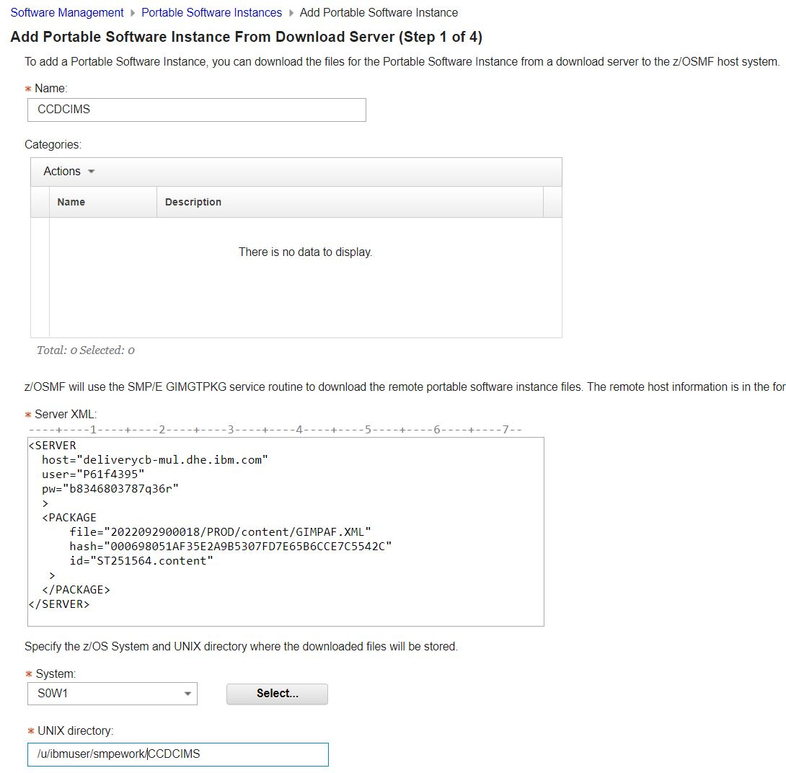
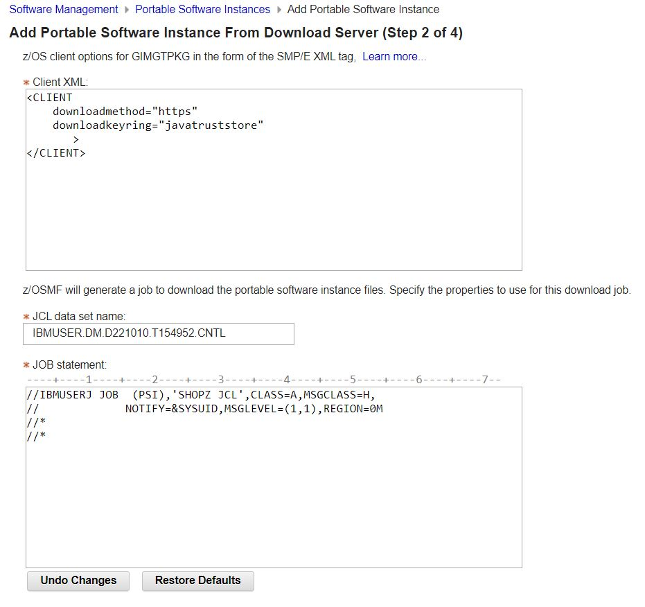
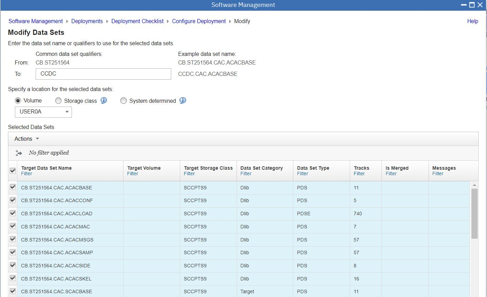
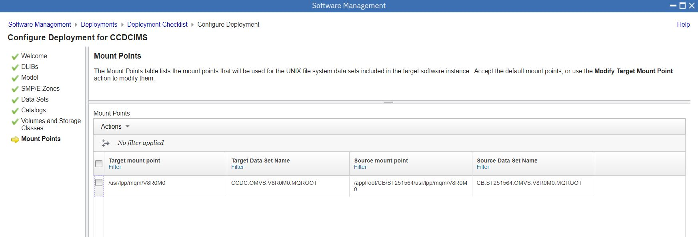

# CCDCIMS PSI.


## ShopZ PSI Download Process.

Order a PSI Serverpac. ( Classic CDC for IMS )
Open the Server XML info, and copy the Server XML snippet to the clipboard.

```
=== Order Size and File System Size Information ========================
The size of your order is 549 MB                                        
                                                                        
== Server XML for Add Portable Software Instance From Download Server ==
You can copy the below statements into the z/OSMF Software Management   
Server XML box.                                                         
                                                                        
<SERVER                                                                 
  host="deliverycb-mul.dhe.ibm.com"                                     
  user="P61f4395"                                                       
  pw="b8346803787q36r"                                                  
  >                                                                     
  <PACKAGE                                                              
      file="2022092900018/PROD/content/GIMPAF.XML"                      
      hash="000698051AF35E2A9B5307FD7E65B6CCE7C5542C"                   
      id="ST251564.content"                                             
   >                                                                    
  </PACKAGE>                                                            
</SERVER>      
```

Open z/OSMF, and open Software Configuration.

```
https://192.168.1.191:10443/zosmf/ 
```

Choose "portable software instances".

Page 1
* name = CCDCIMS 
* SERVER = paste XML
* System = S0W1
* USS Directory = /u/ibmuser/smpework/CCDCIMS



Page 2. Accept previous defaults ( CLIENT XML and JOB Card ) 



Submit Job

Watch the smpework ZFS fill up.

```
IBMUSER:/u/ibmuser/smpework/CCDCIMS: >ls -al
total 4016
drwxrwxr-x   2 OMVSKERN SYS1        8192 Oct  9 23:43 .
drwxrwxrwx   6 OMVSKERN SYS1        8192 Oct  9 23:42 ..
-rw-rw-rw-   1 OMVSKERN SYS1         405 Oct  9 23:43 CPYRIGHT
-rw-rw-rw-   1 OMVSKERN SYS1       72160 Oct  9 23:43 GIMPAF.XML
-rw-rw-rw-   1 OMVSKERN SYS1      134013 Oct  9 23:43 IZUD00DF.json
-rw-rw-rw-   1 OMVSKERN SYS1       32256 Oct  9 23:43 S0003.CB.ST251564.CAC.ACACBASE.pax.Z
-rw-rw-rw-   1 OMVSKERN SYS1       32256 Oct  9 23:43 S0004.CB.ST251564.CAC.ACACCONF.pax.Z
-rw-rw-rw-   1 OMVSKERN SYS1     1724032 Oct  9 23:43 S0005.CB.ST251564.CAC.ACACLOAD.pax.Z
```

When Download finishes RC00

Page 3. Accept Job Settings, Job Card etc... for the SMPE jobs to be generated

Page 4. Finish

## PSI Deployment

Follow the normal Deployment workflow
  
* welcome - press next
* DLIBS - YES, we do want to copy the DLIBs
* Model - Accept the Deployment Source as the model
* SMPE Zones - Accept names from model MVST100 & MVSD100
* Datasets - Names, volumes, storage groups : select ALL ... HLQ = CCDC ; Volume = USER0A
* Catalogs - Accept CATALOG.Z25A.MASTER
* Volumes and Storage Classes - default
* Mount Points - /usr/lpp/mqm/V8R0M0	CCDC.OMVS.V8R0M0.MQROOT  (screenshot below)

Datasets

 

ZFS File Systems




Job Settings for the deployment jobs:

```
IBMUSER.DM.D221010.T164457.CNTL
```


