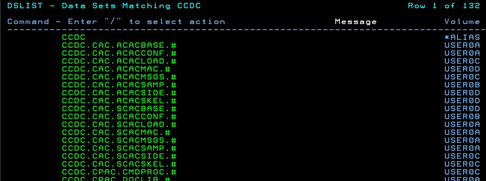
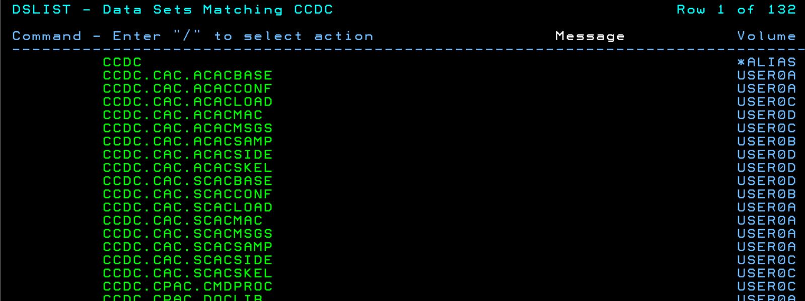
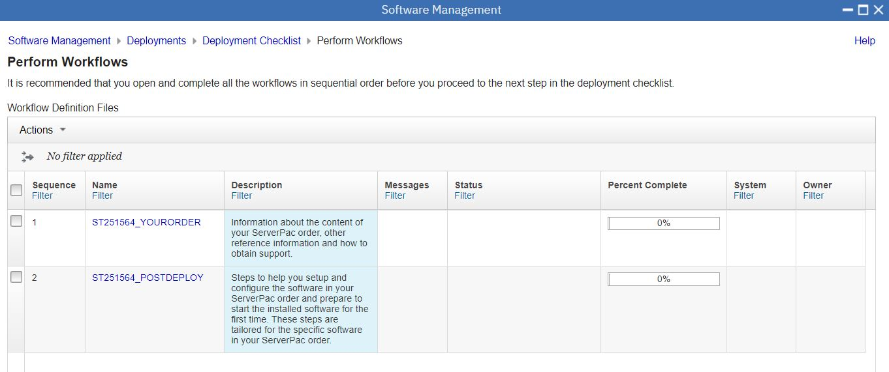
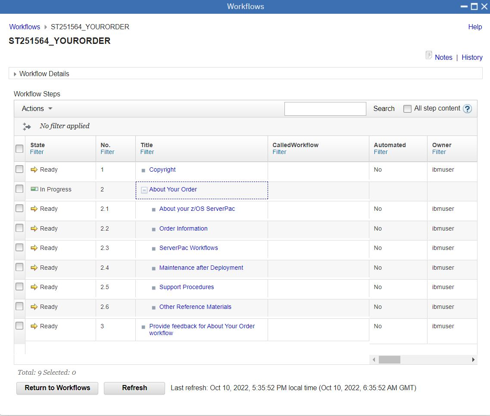
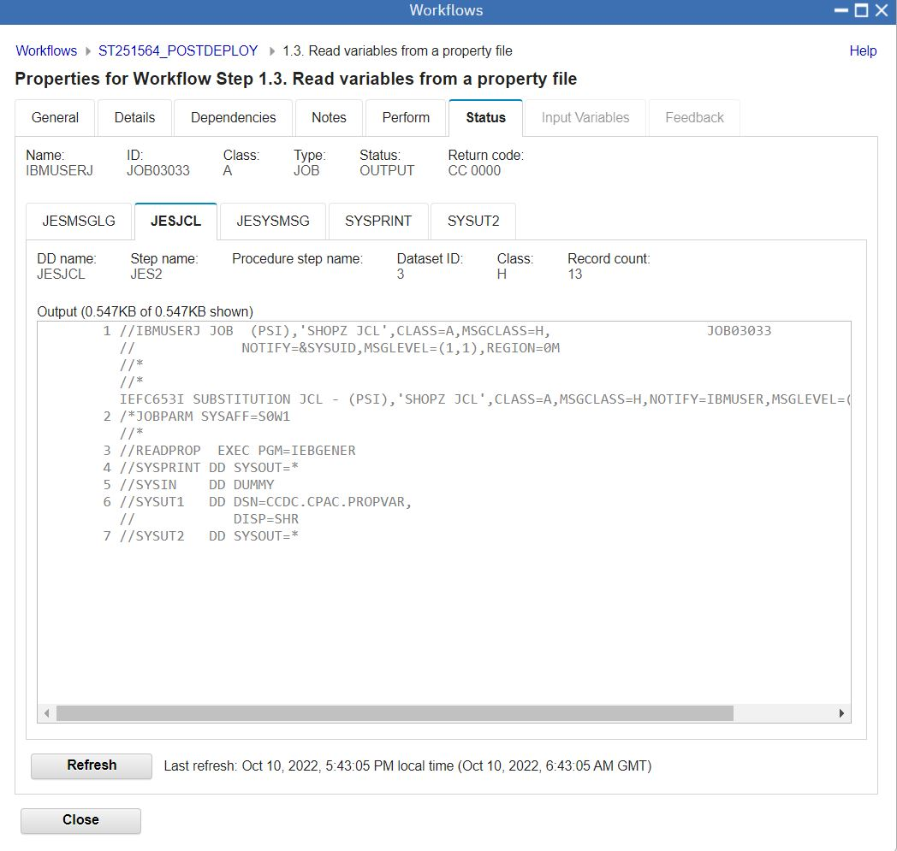
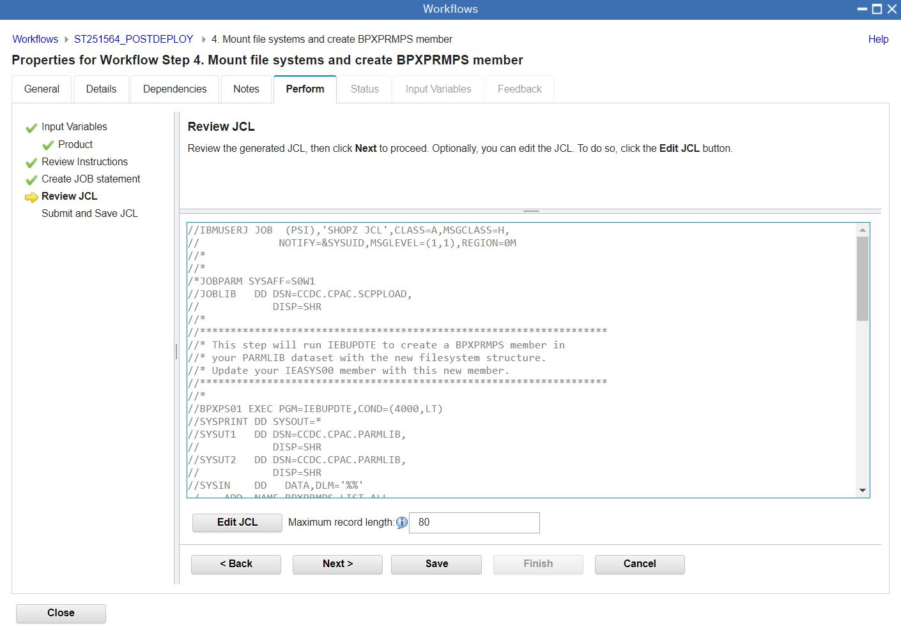
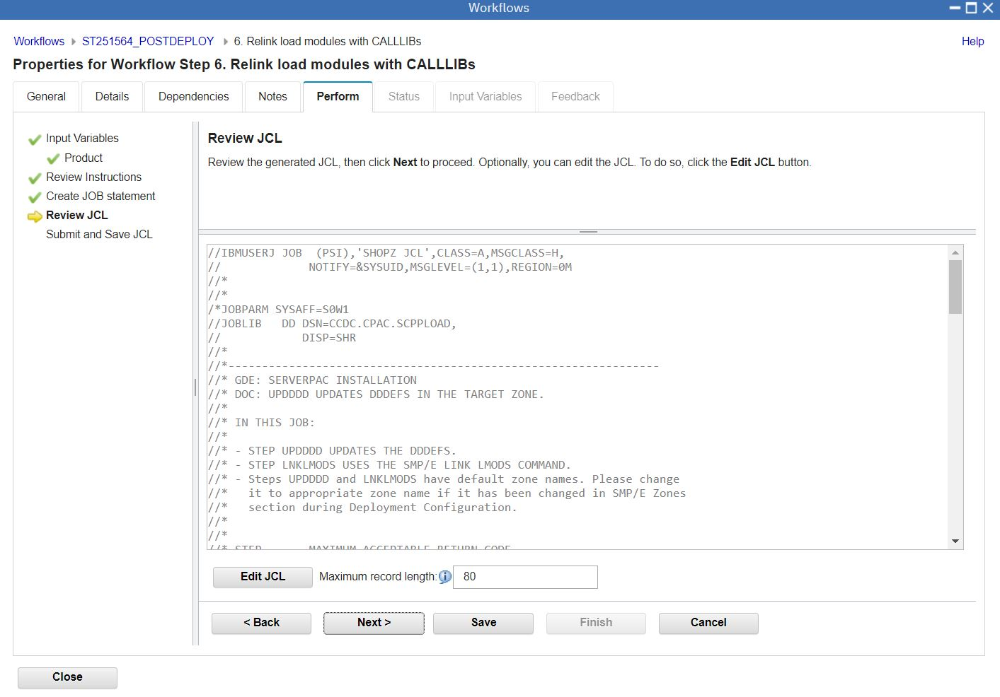

# CCDCIMS PSI.


## ShopZ PSI Download Process.

Order a PSI Serverpac. ( Classic CDC for IMS )
Open the Server XML info, and copy the Server XML snippet to the clipboard.

```
=== Order Size and File System Size Information ========================
The size of your order is 549 MB                                        
                                                                        
== Server XML for Add Portable Software Instance From Download Server ==
You can copy the below statements into the z/OSMF Software Management   
Server XML box.                                                         
                                                                        
<SERVER                                                                 
  host="deliverycb-mul.dhe.ibm.com"                                     
  user="P61f4395"                                                       
  pw="b8346803787q36r"                                                  
  >                                                                     
  <PACKAGE                                                              
      file="2022092900018/PROD/content/GIMPAF.XML"                      
      hash="000698051AF35E2A9B5307FD7E65B6CCE7C5542C"                   
      id="ST251564.content"                                             
   >                                                                    
  </PACKAGE>                                                            
</SERVER>      
```

Open z/OSMF, and open Software Configuration.

```
https://192.168.1.191:10443/zosmf/ 
```

Choose "portable software instances".

Page 1
* name = CCDCIMS 
* SERVER = paste XML
* System = S0W1
* USS Directory = /u/ibmuser/smpework/CCDCIMS


Page 2. Accept previous defaults ( CLIENT XML and JOB Card ) 


Submit Job

Watch the smpework ZFS fill up.

```
IBMUSER:/u/ibmuser/smpework/CCDCIMS: >ls -al
total 4016
drwxrwxr-x   2 OMVSKERN SYS1        8192 Oct  9 23:43 .
drwxrwxrwx   6 OMVSKERN SYS1        8192 Oct  9 23:42 ..
-rw-rw-rw-   1 OMVSKERN SYS1         405 Oct  9 23:43 CPYRIGHT
-rw-rw-rw-   1 OMVSKERN SYS1       72160 Oct  9 23:43 GIMPAF.XML
-rw-rw-rw-   1 OMVSKERN SYS1      134013 Oct  9 23:43 IZUD00DF.json
-rw-rw-rw-   1 OMVSKERN SYS1       32256 Oct  9 23:43 S0003.CB.ST251564.CAC.ACACBASE.pax.Z
-rw-rw-rw-   1 OMVSKERN SYS1       32256 Oct  9 23:43 S0004.CB.ST251564.CAC.ACACCONF.pax.Z
-rw-rw-rw-   1 OMVSKERN SYS1     1724032 Oct  9 23:43 S0005.CB.ST251564.CAC.ACACLOAD.pax.Z
```

When Download finishes RC00

Page 3. Accept Job Settings, Job Card etc... for the SMPE jobs to be generated

Page 4. Finish

## PSI Deployment

Follow the normal Deployment workflow
  
* welcome - press next
* DLIBS - YES, we do want to copy the DLIBs
* Model - Accept the Deployment Source as the model
* SMPE Zones - Accept names from model MVST100 & MVSD100
* Datasets - Names, volumes, storage groups : select ALL ... HLQ = CCDC ; Volume = USER0A
* Catalogs - Accept CATALOG.Z25A.MASTER
* Volumes and Storage Classes - default
* Mount Points - /usr/lpp/mqm/V8R0M0	CCDC.OMVS.V8R0M0.MQROOT  (screenshot below)

Datasets

 

ZFS File Systems


Job Settings for the deployment jobs:

```
IBMUSER.DM.D221010.T164457.CNTL
```

Now, Submit the Jobs, one by one, through the z/OSMF user interface.


Three jobs are generated.
* IZUD01UZ	Unzip Data Sets: Run This
* IZUD02RN	Rename Data Sets: Run This
* IZUD03UC	Update CSI Data Sets: Run This  

The Unzip job produces this outcome.



The rename job produces this outcome.



And the CSI Job just updates the information in the CSI zones to reflect what has been done.
The deployment jobs should now all show as complete.


## Perform Post-Install Workflows

There are two workflows to review.




The "Your Order" Workflow is motherhood and apple pie. Just click yes, yes, yes




The Post Deploy Workflow is important for the product to work.


Option to Read variables from a properties file of a previous installation ( or not ).



RACF Job doing a lot of stuff that I don't understand.


Runs fine, RC00, with lots of IBMUSER already has this power informational messages.


Job to update a subsystem PARMLIB.

 

Job to mount the filesystems for MQ.



Job to Update the new SMPE DDDEFs.


Job to Relink load modeules with CALLLIBs.



Job to Write Variables to a property file.


## Class CDC for IMS Customisation 

Edit CCDC.CAC.SCACSAMP(CECCUSC1) and submit to generate the Instance Libraries

```
//CECCUSC1 JOB (ACCOUNT),'CLASSIC JOB',MSGCLASS=X,CLASS=A,     
//             MSGLEVEL=(1,1),NOTIFY=&SYSUID                   
//*                                                            
//PROCESS   OUTPUT  DEFAULT=YES,CLASS=*,JESDS=ALL,OUTDISP=HOLD 
//*                                                            
//GENSAMP PROC CAC='CCDC.CAC',    INSTALLED HIGH LEVEL QUALIFIER  
//             DISKU='SYSALLDA',    DASD UNIT                     
//             DISKVOL='USER0A',  DASD VOLSER                     
//             ISPHLQ='ISP',    ISPF HLQ                          
//             ISPLANG='ENU'   ISPF LANGUAGE                      
//*                                                               
//CACNOP    EXEC PGM=IEFBR14,                                    
//             PARM='&CAC &DISKU &DISKVOL &ISPHLQ &ISPLANG'      
//*                                                              
//* -------------------------------------------------------------
//*                                                              
//*  EXECUTE THE USER SAMPLES ALLOCATION UTILITY                 
//*                                                              
//* -------------------------------------------------------------
//*                                                              
//CRTSAMP   EXEC PGM=IKJEFT1A,REGION=0M                          
//STEPLIB   DD DISP=SHR,DSN=&ISPHLQ..SISPLOAD                    
//          DD DISP=SHR,DSN=&ISPHLQ..SISPLPA                     
//          DD DISP=SHR,DSN=&CAC..SCACLOAD                       
//SYSOUT    DD SYSOUT=*                                          
//SYSPRINT  DD SYSOUT=*                                          
//SYSTSPRT  DD SYSOUT=*                                          
//ISPFTTRC  DD SYSOUT=*,DCB=(LRECL=256,RECFM=VB)                 
//ISPPROF   DD DSN=&&PROF,                                       
//             DISP=(NEW,DELETE),                                
//             UNIT=&DISKU,                                      
//             SPACE=(CYL,(1,,10)),                              
//             DCB=(LRECL=80,BLKSIZE=6160,RECFM=FB,DSORG=PO)     
//*                                                              
//SYSPROC   DD DISP=SHR,DSN=&CAC..SCACSAMP                       
//ISPTABL   DD DISP=SHR,DSN=&CAC..SCACSAMP                       
//ISPSLIB   DD DISP=SHR,DSN=&CAC..SCACSKEL                       
//ISPTLIB   DD DISP=SHR,DSN=&ISPHLQ..SISPT&ISPLANG               
//ISPPLIB   DD DISP=SHR,DSN=&ISPHLQ..SISPP&ISPLANG               
//ISPMLIB   DD DISP=SHR,DSN=&ISPHLQ..SISPM&ISPLANG               
//*                                                              
//ISPWRK1   DD DISP=(NEW,DELETE),                                
//             UNIT=&DISKU,                                      
//             SPACE=(TRK,(15,15)),                              
//             DCB=(LRECL=256,BLKSIZE=2560,RECFM=FB,DSORG=PS)    
//*                                                              
//ISPLOG    DD SYSOUT=*,                                         
//             DCB=(RECFM=FBA,BLKSIZE=121,LRECL=121)             
//ISPLIST   DD DUMMY,                                            
//             DCB=(RECFM=FBA,BLKSIZE=121,LRECL=121)             
//ISPLST1   DD DUMMY,                                            
//             DCB=(RECFM=FBA,BLKSIZE=121,LRECL=121)             
//ISPLST2   DD DUMMY,                                            
//             DCB=(RECFM=FBA,BLKSIZE=121,LRECL=121)             
//         PEND                                                  
//*                                                              
//GENSAMPE EXEC GENSAMP                                          
//CRTSAMP.SYSTSIN  DD *                                          
 PROFILE NOPREFIX  MSGID                                         
                                                                 
 ISPSTART CMD(%CACCUSX1                                         +
      CACDUNIT=SYSALLDA                                         +
  /*  CACDVOLM=<CACDVOLM>         UNCOMMENT IF NEEDED  */       +
  /*  CACMGTCL=<CACMGTCL>         UNCOMMENT IF NEEDED  */       +
  /*  CACSTGCL=<CACSTGCL>         UNCOMMENT IF NEEDED  */       +
      CACINHLQ=CCDC.CAC                                         +
      CACUSHLQ=CCDC.CAC.I1                                      +
      ISPFHLQ=ISP                                               +
      ISPFLANG=ENU                                              +
      SERVERROLE=(CDC_IMS_SRC)                                  +
 )                                                               
/*                                                               
```


### Failed on REXX
debugged with Gregg and Deepak
compiled versions of CACCUSX1, X2, X3 & X4 were corrupt.
deployed interpretative versions - same error.
Solution was to Add CACCUCX4 to the end of the code for X1 & X2.

## Remainder of Customisation and Instance IVP


IMSINHLQ="DFSF10"
Notfn Port 5003
DRA = IBMUSER
DRA Suffix 00

CDCMQHLQ="CSQ920"
CDCMQMGR="CSQ9"  
CDCBKMKQ="CCDC.BOOKMARK"
CDCSUBLQ="CCDC.PUBCSV"  
CCDC.PUBBINASIS 


APF Authorise CCDC.CAC.SCACLOAD

Port 9087

CECCUCS1

CECCUSPC
CECCUSC2 - generate samples


CCDC.CAC.I1.USERSAMP(CECCDSLS)
Define DASD only log streams


CCDC.CAC.I1.USERSAMP(CECCRZCT)
Create Catalog ZFS
CCDC.CAC.I1.ZFS

mkdir /opt/IBM/isclassic113/catalog

Temporary mount
mount -f CCDC.CAC.I1.ZFS /opt/IBM/isclassic113/catalog

ADCD.Z25A.PARMLIB(BPXPRMDB)
===
MOUNT    FILESYSTEM('CCDC.CAC.I1.ZFS')              
         TYPE(ZFS)                                  
         MODE(RDWR)                                 
         MOUNTPOINT('/opt/IBM/isclassic113/catalog')
		 
		 
CCDC.CAC.I1.USERSAMP(CECCDCFG)
Configuration Files 


CCDC.CAC.I1.USERSAMP(CECCDCAT)
Classic Catalog 


CCDC.CAC.I1.USERSAMP(CECCDSUB)
Replication Mapping Dataset


CCDC.CAC.I1.USERSAMP(CECPBKLQ) 
Create Boommark Queue

!!!!
DEFINE QL(CCDC.BOOKMARK) +                                 
  DEFPSIST(YES) GET(ENABLED) INDXTYPE(MSGID) PUT(ENABLED) +
  DEFSOPT(SHARED) SHARE                                    

CSQ9016E %CSQ9 ' DEFINE' command request not authorized
CSQ9023E %CSQ9 CSQ9SCND 'DEFINE QL' ABNORMAL COMPLETION


RDEFINE MQADMIN CSQ9.** OWNER(IBMUSER) UACC(NONE) 
PERMIT CSQ9.** CLASS(MQADMIN) ID(IBMUSER) ACCESS(ALTER) 
SETROPTS REFRESH GENERIC(MQADMIN)
SETROPTS REFRESH RACLIST(MQADMIN) 


Andrew Said :
rdef mqadmin CSQ9.NO.SUBSYS.SECURITY
/%CSQ9 REFRESH SECURITY


Start Classic CDC : CCDC.CAC.I1.USERSAMP(CECCDSRC)
S047 - APF Not AUthorised 
D PROG,APF 

//STEPLIB  DD DISP=SHR,DSN=&CAC..SCACLOAD                 
//         DD DISP=SHR,DSN=&MQS..SCSQANLE                 
//         DD DISP=SHR,DSN=&MQS..SCSQAUTH                 
//         DD DISP=SHR,DSN=&IMS..SDFSRESL                 

IPLwith PARM AL 


Assemble the DRA Startup Module
IBMUSER.CCDCIMS(ASMBLDRA)

Update DRA Startup Module 
DRATABLESUFFIX=1 
DRAUSER=IBMUSER 


Copy CCDC.CAC.SCACLOAD(DFSFLGX0) to DFSF10.SDFSRESL 
Copy CCDC.CAC.SCACLOAD(DFSPPUE0) to DFSF10.SDFSRESL 


Edit CCDC.CAC.I1.USERSAMP(CECE1OPT)
IP=192.168.1.191
Port=5003 


Assemble the Notification Module
IBMUSER.CCDCIMS(ASMNOTFN)


Augment the Database
DFSF10.SDFSISRC(DI21PART)
Add EXIT  clause to 3 segments.
 
ACBGEN 
IBMUSER.CCDCIMS(DBDGEN)
R 3,/CHE DUMPQ.
 


Windows - Install Access Server ( cdcadmin / C0caC0la ) port 10101 , no LDAP
Windows - Install Management Console , no LDAP 


Y IPL.
Y Wait for IMS Up.
Y Start CCDCIMS, View SDSF Output. Connect to DRA
Y Connect from CDA Console.
Y Connect from CDA Explorer.
Y Define STOKSTAT and STANINFO as Query, Update & Capture.   !!! ALTER FAIL - NO CDC in CDA, SYNTAX in IMS !!!
Y Deploy DDL.
Y Test Query.
Y Define Subscription to CCDC.PUBCSV
Y Test CDC.
Y View CSV Record in MQ Explorer
Create New Copybook for PUBBINASIS.
Define New IMS Table in CDA.
Query.
Create Subscription to CCDC.PUBBINASIS
Test CDC, View in MQ Explorer. 


