# CCDCIMS PSI.


## ShopZ PSI Download Process.

Order a PSI Serverpac. ( Classic CDC for IMS )

Review the Download Package


Open the Server XML info, and copy the Server XML snippet to the clipboard.

```
=== Order Size and File System Size Information ========================
                                                                        
The size of your order is 549 MB                                        
                                                                        
You need space in the file system used by z/OSMF Software Management    
Add Portable Software Instance for approximately twice the size of your 
order. To convert to 3390 cylinders, multiply the number of MB by 1.25  
and then multiply by 2.                                                 
                                                                        
For example, for a size of 5000 MB, then:                               
( (5,000 MB) * (1.25 CYL/MB) ) * 2 = 12,500 cylinders                   
                                                                        
== Server XML for Add Portable Software Instance From Download Server ==
You can copy the below statements into the z/OSMF Software Management   
Server XML box.                                                         
                                                                        
<SERVER                                                                 
  host="deliverycb-mul.dhe.ibm.com"                                     
  user="P61f4395"                                                       
  pw="b8346803787q36r"                                                  
  >                                                                     
  <PACKAGE                                                              
      file="2022092900018/PROD/content/GIMPAF.XML"                      
      hash="000698051AF35E2A9B5307FD7E65B6CCE7C5542C"                   
      id="ST251564.content"                                             
   >                                                                    
  </PACKAGE>                                                            
</SERVER>      
```

Open z/OSMF, and open Software Configuration.

```
https://192.168.1.191:10443/zosmf/ 
```

Choose "portable software instances"

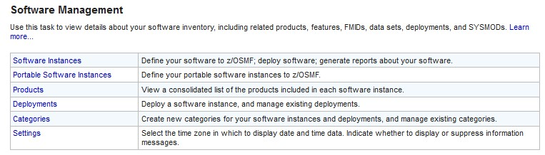

Add from Download Server

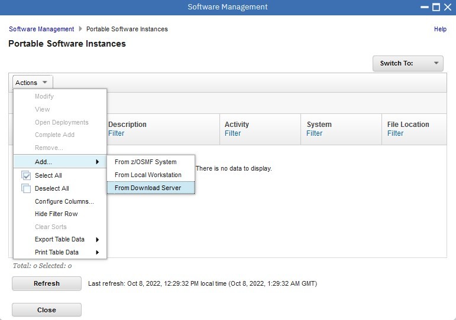

Page 1


Page 2 


Submit Job


Let the Software Download Job Run. Watch the smpework ZFS fill up.

```
IBMUSER:/u/ibmuser/smpework/ccdcims: >ls
CPYRIGHT                              S0005.CB.ST251564.CAC.ACACLOAD.pax.Z  S0010.CB.ST251564.CAC.ACACSKEL.pax.Z
GIMPAF.XML                            S0006.CB.ST251564.CAC.ACACMAC.pax.Z   S0011.CB.ST251564.CAC.SCACBASE.pax.Z
IZUD00DF.json                         S0007.CB.ST251564.CAC.ACACMSGS.pax.Z  S0012.CB.ST251564.CAC.SCACCONF.pax.Z
S0003.CB.ST251564.CAC.ACACBASE.pax.Z  S0008.CB.ST251564.CAC.ACACSAMP.pax.Z  S0013.CB.ST251564.CAC.SCACLOAD.pax.Z
S0004.CB.ST251564.CAC.ACACCONF.pax.Z  S0009.CB.ST251564.CAC.ACACSIDE.pax.Z
IBMUSER:/u/ibmuser/smpework/ccdcims: >
```

Back to Step 3 of the Download workflow. Refresh etc... Remember to complete Steps 3 & 4 before going to deployment of PSI.


You Supplied the Job Card, which allows you to watch progress in SDSF.


As the download progresses, not that as well as downloading the ST251564 sysmod, it is also downloading all the SMPE work datasets.

```
-rw-rw-rw-   1 OMVSKERN SYS1      225792 Oct  7 20:35 S0114.CB.ST251564.SMPE.GLOBAL.CSI.pax.Z
-rw-rw-rw-   1 OMVSKERN SYS1      677376 Oct  7 20:35 S0115.CB.ST251564.SMPE.MVS.DLIB.CSI.pax.Z
-rw-rw-rw-   1 OMVSKERN SYS1      806400 Oct  7 20:35 S0116.CB.ST251564.SMPE.MVS.TARGET.CSI.pax.Z
-rw-rw-rw-   1 OMVSKERN SYS1       32256 Oct  7 20:35 S0117.CB.ST251564.SMPE.MVSD100.SMPDLOG.pax.Z
-rw-rw-rw-   1 OMVSKERN SYS1       32256 Oct  7 20:35 S0118.CB.ST251564.SMPE.MVSD100.SMPDLOGA.pax.Z
-rw-rw-rw-   1 OMVSKERN SYS1       32256 Oct  7 20:35 S0119.CB.ST251564.SMPE.MVST100.SMPMTS.pax.Z
-rw-rw-rw-   1 OMVSKERN SYS1       64512 Oct  7 20:35 S0120.CB.ST251564.SMPE.MVST100.SMPSCDS.pax.Z
-rw-rw-rw-   1 OMVSKERN SYS1       32256 Oct  7 20:36 S0121.CB.ST251564.SMPE.MVST100.SMPSTS.pax.Z
-rw-rw-rw-   1 OMVSKERN SYS1       32256 Oct  7 20:36 S0122.CB.ST251564.SMPE.MVST100.SMPTLOG.pax.Z
-rw-rw-rw-   1 OMVSKERN SYS1       32256 Oct  7 20:36 S0123.CB.ST251564.SMPE.MVST100.SMPTLOGA.pax.Z
-rw-rw-rw-   1 OMVSKERN SYS1       32256 Oct  7 20:36 S0124.CB.ST251564.SMPE.SMPGLOG.pax.Z
-rw-rw-rw-   1 OMVSKERN SYS1       32256 Oct  7 20:36 S0125.CB.ST251564.SMPE.SMPGLOGA.pax.Z
-rw-rw-rw-   1 OMVSKERN SYS1     14356096 Oct  7 20:38 S0126.CB.ST251564.SMPE.SMPPTS.pax.Z
```


The z/OSMF UI does not notify successful completion of job. Hence, logon to SDSF and wait for RC 0000.


```
1                       J E S 2  J O B  L O G  --  S Y S T E M  S 0 W 1  --  N O D E  S 0 W 1
0
 11.24.43 JOB03190 ---- SATURDAY,  08 OCT 2022 ----
 11.24.43 JOB03190  IRR010I  USERID IBMUSER  IS ASSIGNED TO THIS JOB.
 11.24.43 JOB03190  ICH70001I IBMUSER  LAST ACCESS AT 09:58:21 ON SATURDAY, OCTOBER 8, 2022
 11.24.43 JOB03190  $HASP373 IBMUSERP STARTED - INIT 1    - CLASS A        - SYS S0W1
 11.24.43 JOB03190  IEF403I IBMUSERP - STARTED - TIME=11.24.43
 11.24.44 JOB03190  -                                      -----TIMINGS (MINS.)------                          -----PAGING COUNTS----
 11.24.44 JOB03190  -STEPNAME PROCSTEP    RC   EXCP   CONN       TCB       SRB  CLOCK          SERV  WORKLOAD  PAGE  SWAP   VIO SWAPS
 11.24.44 JOB03190  -PREPODIR             00     96      0       .00       .00     .0             2  BATCH        0     0     0     0
 11.47.44 JOB03190  -GIMGTPKG             00  76451      0       .05       .00   22.9             6  BATCH        0     0     0     0
 11.47.44 JOB03190  IEF404I IBMUSERP - ENDED - TIME=11.47.44
 11.47.44 JOB03190  -IBMUSERP ENDED.  NAME-SHOPZ PSI            TOTAL TCB CPU TIME=      .05 TOTAL ELAPSED TIME=  23.0
 11.47.44 JOB03190  $HASP395 IBMUSERP ENDED - RC=0000
0------ JES2 JOB STATISTICS ------
-  08 OCT 2022 JOB EXECUTION DATE
-           87 CARDS READ
-        2,897 SYSOUT PRINT RECORDS
-            0 SYSOUT PUNCH RECORDS
-          150 SYSOUT SPOOL KBYTES
-        23.00 MINUTES EXECUTION TIME

```


Press next on Page 3

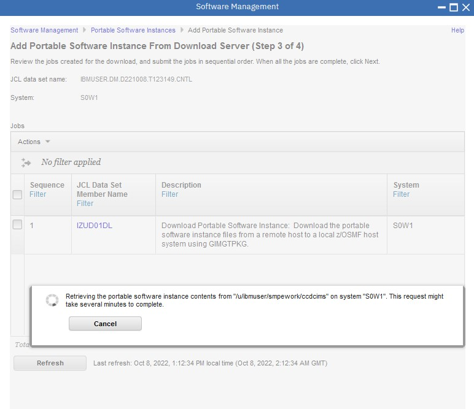


Research IZUD277E and find an APAR ( https://www.ibm.com/support/pages/apar/PI79663 )

```
.- Add for a portable software instance that contains non-SMP/E
.  products will fail with existing message IZUD277E:  An error
.  was found in file <file-name>. Error: The file contains data
.  that is not supported by the current level of z/OSMF.  The
.  version = 2.
```

Ordered PI79663 from ShopZ

```
//RFNJOBH JOB your_jobcard_information                                          
//*                                                                             
//*******************************************************************           
//*            TURN CAPS OFF AS THIS JOB CONTAINS CASE                          
//*                 SENSITIVE CONTROL INFORMATION.                              
//********************************************************************          
//*                                                                             
//* This job will pull the service package from the IBM server to               
//* your host system.                                                           
//*                                                                             
//* Change the JOB card above to match your installations                       
//* requirements.                                                               
//*                                                                             
//* SMP/E zone-related files are assumed to be defined in your                  
//* global CSI.  See the SMP/E Commands manual for a list of                    
//* the required DDDEF entries.                                                 
//*                                                                             
//*                                                                             
//* NOTE 1: Change smpe.global.csi to the name of the SMP/E                     
//*         GLOBAL CSI you intend to use.                                       
//*                                                                             
//* NOTE 2: Change the SMPNTS DD statement to a directory name                  
//*         on your host system.                                                
//*                                                                             
//* NOTE 3: Uncomment/Update the SMPWKDIR DD statements if you                  
//*         intend on using a separate path/file system for                     
//*         workspace. SMP/E will use that directory to unzip                   
//*         the files during RECEIVE processing after which they                
//*         will be deleted from that path.                                     
//*                                                                             
//* NOTE 4: Uncomment/update the SMPCPATH DD                                    
//*         Statement to point to the SMP/E Class libraries.                    
//*                                                                             
//* NOTE 5: If you only want to transfer the package back to                    
//*         your host but do not want to RECEIVE the package into the           
//*         global zone you specified on the SMPCSI DD statement, then          
//*         uncomment the TRANSFERONLY operand on the RECEIVE command.          
//*         The files in the package will be transferred to your                
//*         host system without being RECEIVED.  You can later                  
//*         perform a RECEIVE FROMNTS using the RCVPDO sample job               
//*         provided in the RIMLIB dataset to do the actual RECEIVE.            
//*                                                                             
//* NOTE 6: Do not remove or comment out the javahome, downloadmethod,          
//*         or downloadkeyring attributes. They are attributes that             
//*         are required by SMP/E and must be assigned values.                  
//*                                                                             
//* NOTE 7: Specify HTTP or SOCKS Proxy Server information if needed.           
//*                                                                             
//* For more information on the specific security set up tasks that             
//* need to be completed on your system to support HTTP Secure (HTTPS),         
//* visit the Shopz home page at:                                               
//* http://www.ibm.com/software/shopzseries/ShopzSeries_public.wss and          
//* in the "Using Shopz" box near the bottom of the page.                       
//*                                                                             
//SMPER1  EXEC PGM=GIMSMP,REGION=0M,                                            
//             PARM='PROCESS=WAIT'                                              
//SMPCSI   DD  DISP=SHR,DSN=smpe.global.csi     <=== NOTE 1                     
//SMPNTS   DD  PATHDISP=KEEP,                                                   
//             PATH='/u/smpe/smpnts/'           <=== NOTE 2                     
//*SMPWKDIR DD  PATHDISP=KEEP,                                                  
//*             PATH='/u/smpe/workdir/'         <=== NOTE 3                     
//*SMPCPATH DD PATH='/usr/lpp/smp/classes/'     <=== NOTE 4                     
//SMPOUT   DD  SYSOUT=*                                                         
//SMPRPT   DD  SYSOUT=*                                                         
//SMPLIST  DD  SYSOUT=*                                                         
//SYSPRINT DD  SYSOUT=*                                                         
//SMPCNTL  DD  *                                                                
  SET      BOUNDARY (GLOBAL) .                                                  
  RECEIVE                                                                       
        FROMNETWORK(                                                            
          SERVER(SERVINFO)                                                      
     /*   TRANSFERONLY                   <=== NOTE 5 */                         
          CLIENT(CLNTINFO)                                                      
          )                                                                     
           .                                                                    
/*                                                                              
//*                                                                             
//* The information provided in the SERVINFO DD has                             
//* been customized for your order.  Please do not                              
//* alter this information.                                                     
//*                                                                             
//SERVINFO DD *                                                                 
  <SERVER                                                                       
    host="deliverycb-bld.dhe.ibm.com"                                                         
    user="S388w420"                                                             
    pw="E856091686k036p"                                                          
    >                                                                           
    <PACKAGE                                                                    
      file="2022100798249/PROD/GIMPAF.XML"                                                      
      hash="52B3BFF58FCCC8CAC3B33705273D83D890F7C117"                                                          
      id="U02386355"                                                            
      >                                                                         
    </PACKAGE>                                                                  
  </SERVER>                                                                     
/*                                                                              
//*                                                                             
//CLNTINFO DD *                                                                 
<!--                                                                 -->        
<!-- NOTE 6:                                                         -->        
<!-- Specify a java home directory for the javahome attribute value. -->        
<!-- Specify the security manager keyring or CERTAUTH virtual        -->        
<!-- keyring or the keyword javatruststore for the downloadkeyring   -->        
<!-- attribute value.                                                -->        
<!--                                                                 -->        
<CLIENT                                                                         
javahome="/java_home_dir"                                                       
downloadmethod="https"                                                          
downloadkeyring="key_ring">                                                     
</CLIENT>                                                                       
/*                                                                              
<!--                                                                 -->        
<!--  NOTE 7:                                                        -->        
<!--  All HTTP and SOCKS Proxy Server tags below are commented out.  -->        
<!--  Remove the XML comment start and end tags to specify HTTP or   -->        
<!--  SOCKS Proxy Server information and add them before the ending  -->        
<!--  CLIENT tag above. The tags are optional and are defined by     -->        
<!--  SMP/E.                                                         -->        
<!--  For information about them, see SMP/E Commands.                -->        
<!--                                                                 -->        
<!-- <HTTPPROXY host="server name|server ip address"                 -->        
<!--  user="userid" pw="password" port="number">                     -->        
<!-- </HTTPPROXY>                                                    -->        
<!--                                                                 -->        
<!-- <HTTPSOCKSPROXY host="server name|server ip address"            -->        
<!--   user="userid" pw="password" port="number">                    -->        
<!-- </HTTPSOCKSPROXY>                                               -->        
<!--                                                                 -->        
//*                                                                             
```


## System REXX DASD Controls.

Prevent allocation on all Neale-defined SMS z Volumes

```
f axr,zvolsoff
```

Selective Enablement of file allocation on chosen z volumes

```
v sms,volume(USER0A),disable,new
v sms,volume(USER0E),enable
```


## ShopZ PSI Install Process.

Open z/OSMF Deployments

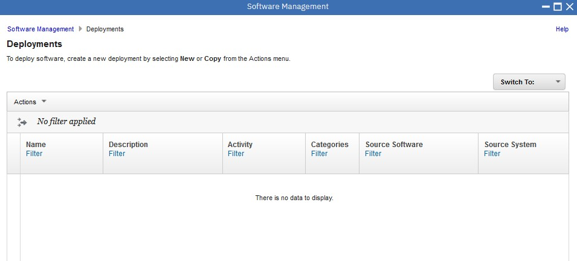


Specify New Deployment

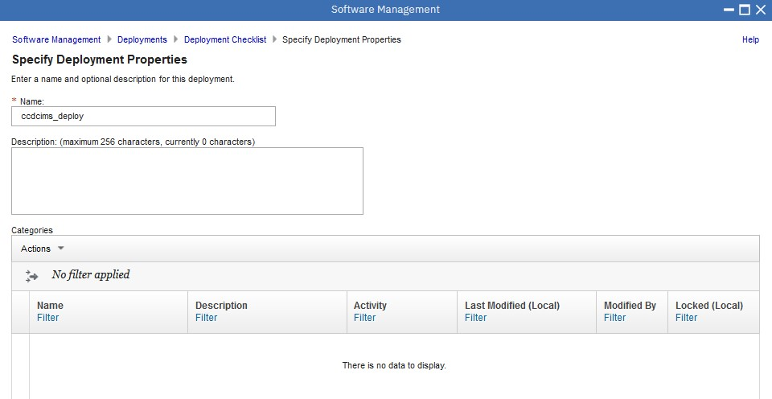

Select The Software to Deploy

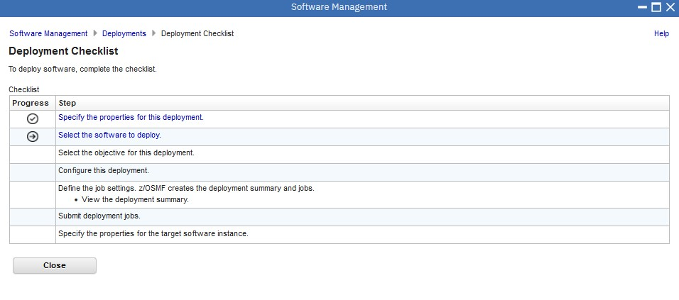

Choose Classic CDC for IMS - Serverpac ST251564

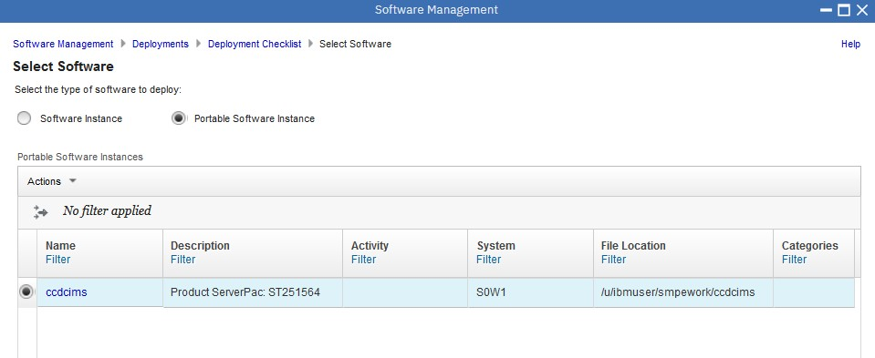

Deployment Objective is New Global CSI

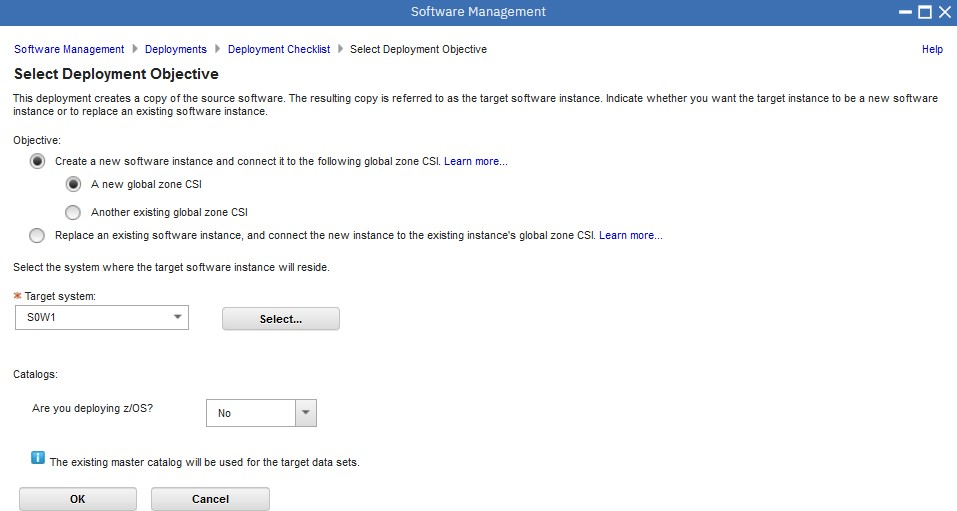

Check for Missing SYSMODS ( Nah )


Configure This Deployment

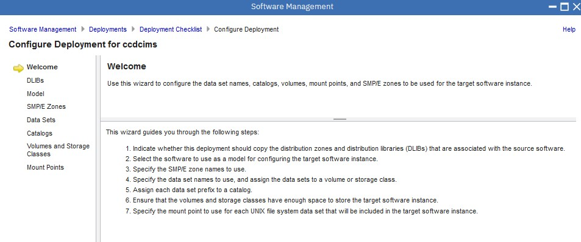

welcome - YES 
DLIBS - YES 
Model - Deployment Source 
SMPE Zones - Names from model TGT + DLIB 
Datasets - Names, volumes, storage groups : select ALL ... modify all  - volume = USER0E
Catalogs - CATALOG.Z25A.MASTER 
Volumes and Storage Classes - default 
Mount Points - define the eventual mount point ( but you need to do that outside PSI )  /u/wallen/hooli - CB.OSHOOLI.ZFS 


Zones - are MVST00 and MVSD100
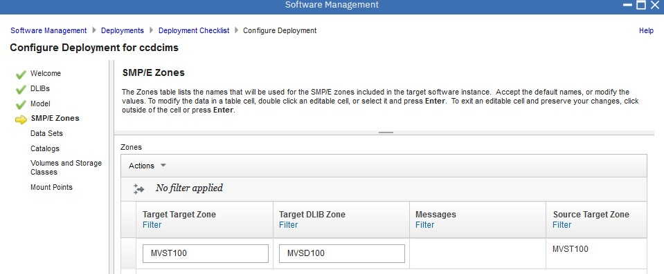

Edit the Target Volumes ( USER0E )


Edit the Target Mount Point 


Define the Job Settings

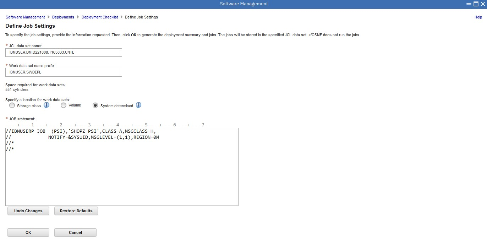

View the Deployment Summary

 

Submit Deployment Jobs

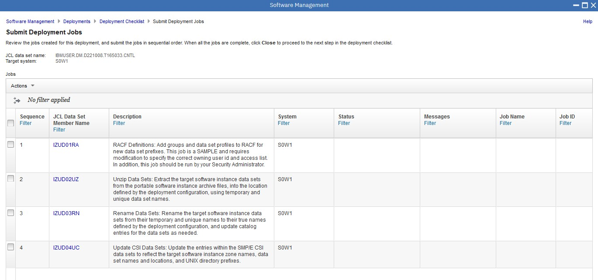

The first Job is (hopefully) avoidable RACF controls that can be ignored.
I just did Override Complete.

Now I submit the second job ( Unzip : IZUD02UZ ).

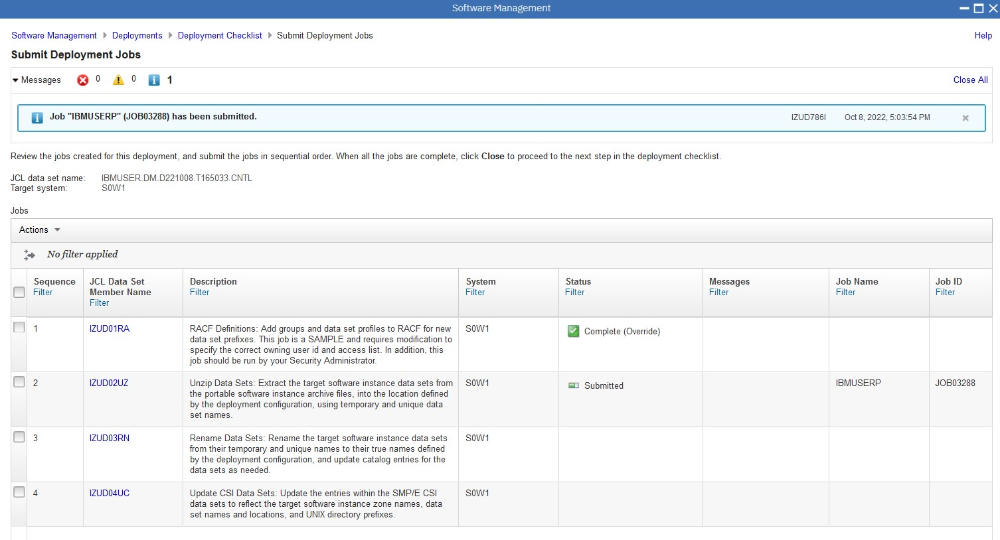

Now I submit the third job ( Rename : IZUD03RN ).

Now I submit the fourth job ( Update CSI : IZUD04UC ).

And it seems to have worked !


Now take a look at the Workflows


Just Click thru the bullshit stuff

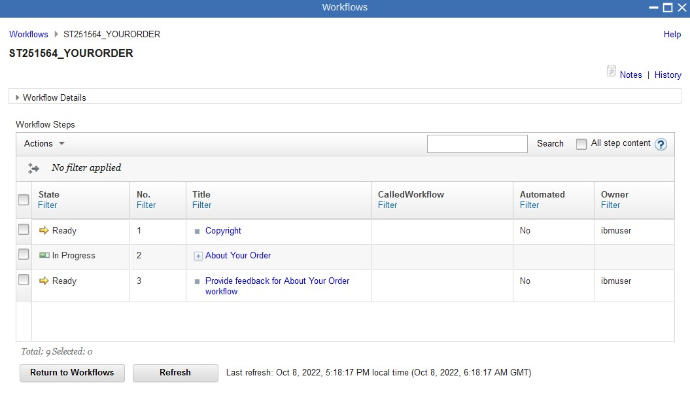

Perform the Post-Install Stuff. This is environment stuff, prior to instance creation.

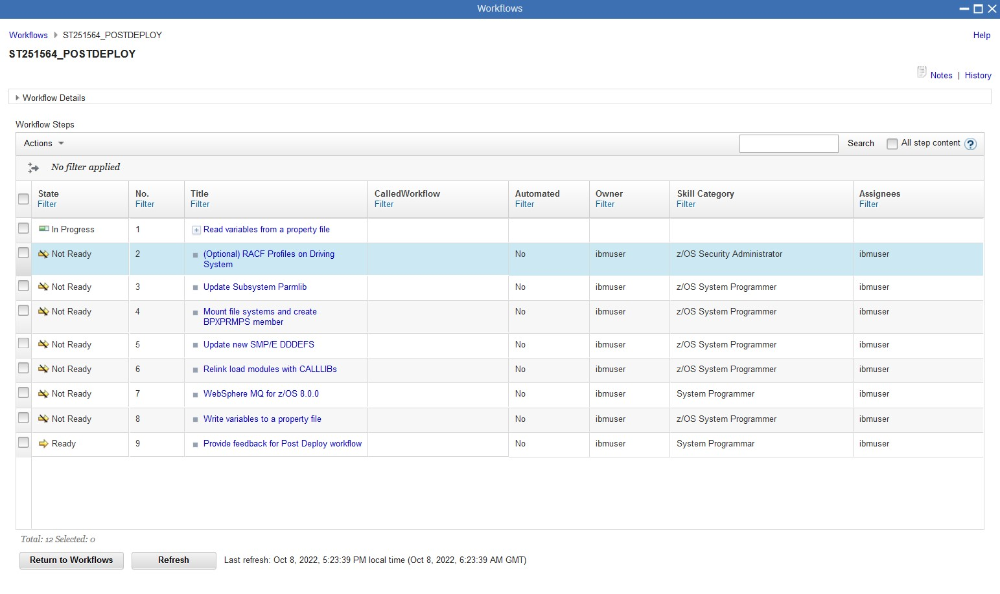


