# CCDCVSAM PSI.


## ShopZ PSI Download Process.

Order a PSI Serverpac. ( Classic CDC for IMS )
Open the Server XML info, and copy the Server XML snippet to the clipboard.

```
=== Order Size and File System Size Information ========================
The size of your order is 549 MB                                        
                                                                        
== Server XML for Add Portable Software Instance From Download Server ==
You can copy the below statements into the z/OSMF Software Management   
Server XML box.                                                         
                                                                        
<SERVER                                                                 
  host="deliverycb-mul.dhe.ibm.com"                                     
  user="P662p007"                                                       
  pw="k6321212q47798D"                                                  
  >                                                                     
  <PACKAGE                                                              
      file="2022101100016/PROD/content/GIMPAF.XML"                      
      hash="B464A6FF704B1718E703C28DCD3ADFFDD5E14214"                   
      id="ST251603.content"                                             
   >                                                                    
  </PACKAGE>                                                            
</SERVER>          
```

Open z/OSMF, and open Software Configuration.

```
https://192.168.1.191:10443/zosmf/ 
```

Choose "portable software instances".

Page 1
* name = CCDCVSAM 
* SERVER = paste XML
* System = S0W1
* USS Directory = /u/ibmuser/smpework/CCDCVSAM ( smpework must be mounted ; CCDCVSAM will be created automatically )

Page 2. Accept previous defaults ( CLIENT XML and JOB Card ) 

Submit Job

Watch the smpework ZFS fill up.


```
IBMUSER:/u/ibmuser/smpework/CCDCVSAM: >ls -al
total 1125744
drwxrwxr-x   2 OMVSKERN SYS1        8192 Oct 26 00:45 .
drwxrwxrwx   8 OMVSKERN SYS1        8192 Oct 26 00:25 ..
-rw-rw-rw-   1 OMVSKERN SYS1         405 Oct 26 00:20 CPYRIGHT
-rw-rw-rw-   1 OMVSKERN SYS1       72160 Oct 26 00:20 GIMPAF.XML
-rw-rw-rw-   1 OMVSKERN SYS1        5040 Oct 26 00:45 GIMPAF.XSL
-rw-rw-rw-   1 OMVSKERN SYS1      134016 Oct 26 00:20 IZUD00DF.json
-rw-rw-rw-   1 OMVSKERN SYS1       32256 Oct 26 00:20 S0003.CB.ST251603.CAC.ACACBASE.pax.Z
-rw-rw-rw-   1 OMVSKERN SYS1       32256 Oct 26 00:20 S0004.CB.ST251603.CAC.ACACCONF.pax.Z
-rw-rw-rw-   1 OMVSKERN SYS1     8870400 Oct 26 00:21 S0005.CB.ST251603.CAC.ACACLOAD.pax.Z
-rw-rw-rw-   1 OMVSKERN SYS1       32256 Oct 26 00:21 S0006.CB.ST251603.CAC.ACACMAC.pax.Z
-rw-rw-rw-   1 OMVSKERN SYS1      387072 Oct 26 00:21 S0007.CB.ST251603.CAC.ACACMSGS.pax.Z
-rw-rw-rw-   1 OMVSKERN SYS1      774144 Oct 26 00:21 S0008.CB.ST251603.CAC.ACACSAMP.pax.Z
-rw-rw-rw-   1 OMVSKERN SYS1       32256 Oct 26 00:21 S0009.CB.ST251603.CAC.ACACSIDE.pax.Z
-rw-rw-rw-   1 OMVSKERN SYS1       64512 Oct 26 00:21 S0010.CB.ST251603.CAC.ACACSKEL.pax.Z
.... etc...
```

When Download finishes RC00

Page 3. Accept Job Settings, Job Card etc... for the SMPE jobs to be generated

Page 4. Finish

## PSI Deployment

Follow the normal Deployment workflow
  
* welcome - press next
* give the deployment a name (CCDCVSAM)
* select the PSI source (CCDCVSAM)
* DLIBS - YES, we do want to copy the DLIBs
* Model - Accept the Deployment Source as the model
* SMPE Zones - Accept names from model MVST100 & MVSD100
* Datasets - Names, volumes, storage groups : select ALL ... HLQ = CCDC ; Volume = USER0A
* Catalogs - Accept CATALOG.Z25A.MASTER
* Volumes and Storage Classes - default
* Mount Points - /usr/lpp/mqm/V8R0M0	CDCV.OMVS.V8R0M0.MQROOT  (screenshot below)

Datasets

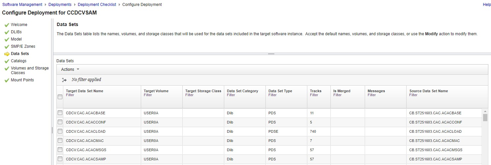 

ZFS File Systems

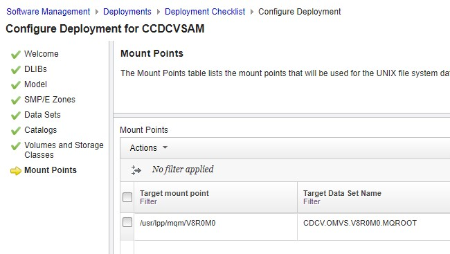


Job Settings for the deployment jobs:

```
IBMUSER.DM.D221026.T171613.CNTL
```

Now, Submit the Jobs, one by one, through the z/OSMF user interface.

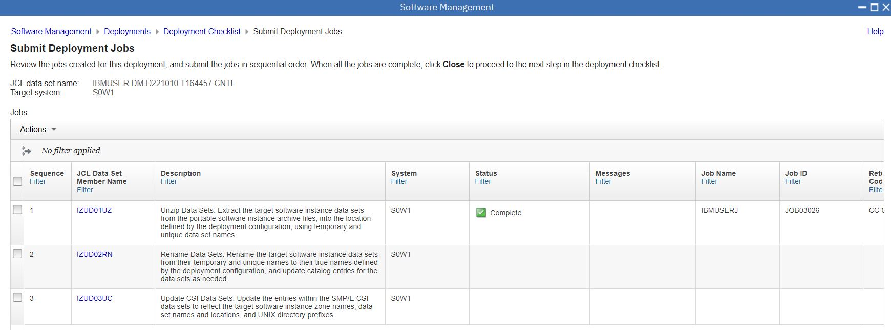

Three jobs are generated.
* IZUD01UZ	Unzip Data Sets: Run This
* IZUD02RN	Rename Data Sets: Run This
* IZUD03UC	Update CSI Data Sets: Run This  

The Unzip job produces this outcome.

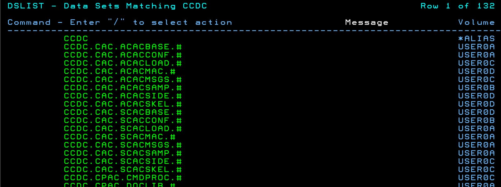

The rename job produces this outcome.

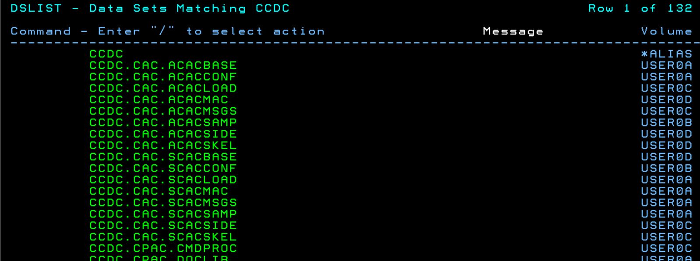

And the CSI Job just updates the information in the CSI zones to reflect what has been done.
The deployment jobs should now all show as complete.

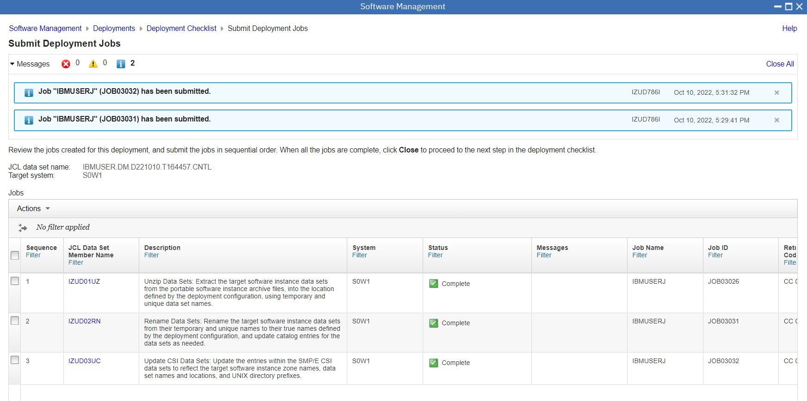


## Perform Post-Install Workflows

There are two workflows to review.

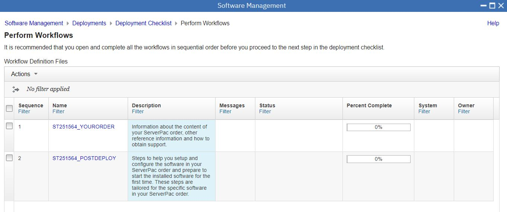


The "Your Order" Workflow is motherhood and apple pie. Just click yes, yes, yes


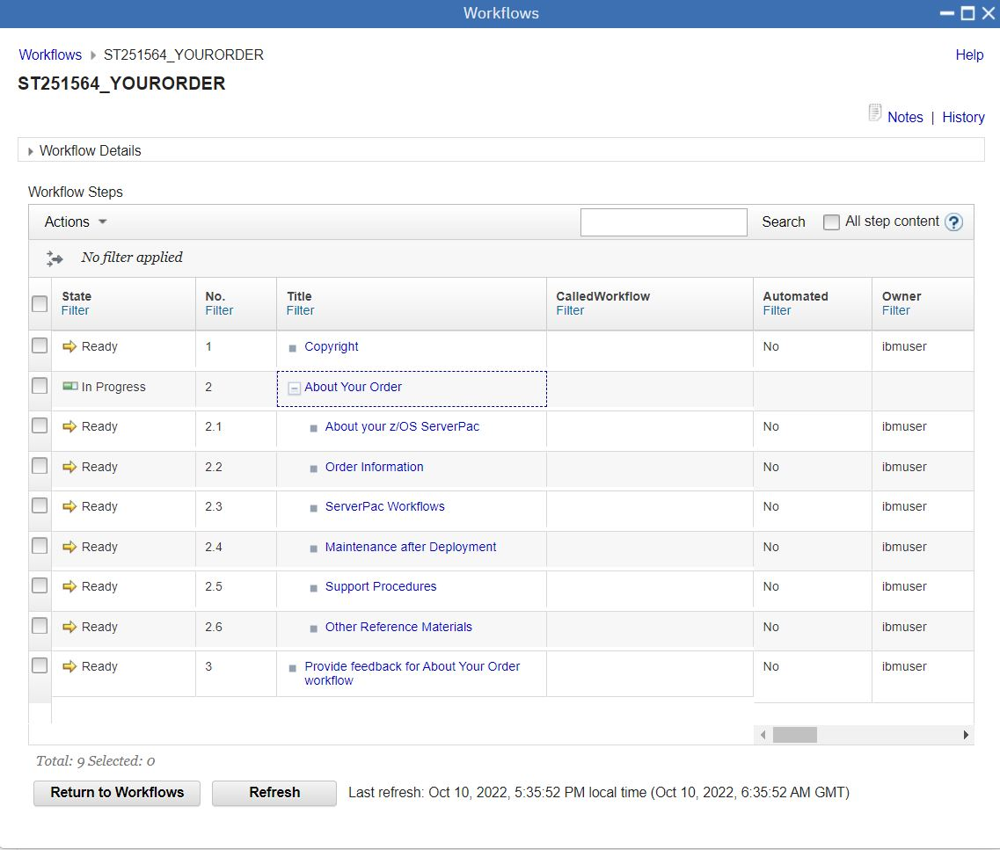

The Post Deploy Workflow is important for the product to work.

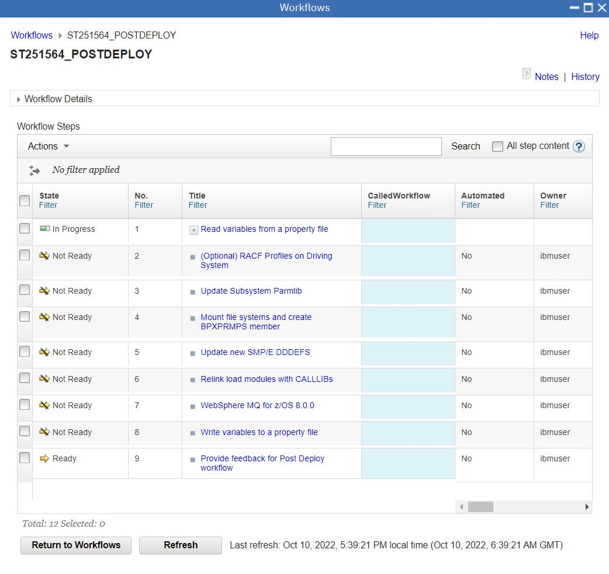

Option to Read variables from a properties file of a previous installation ( or not ).

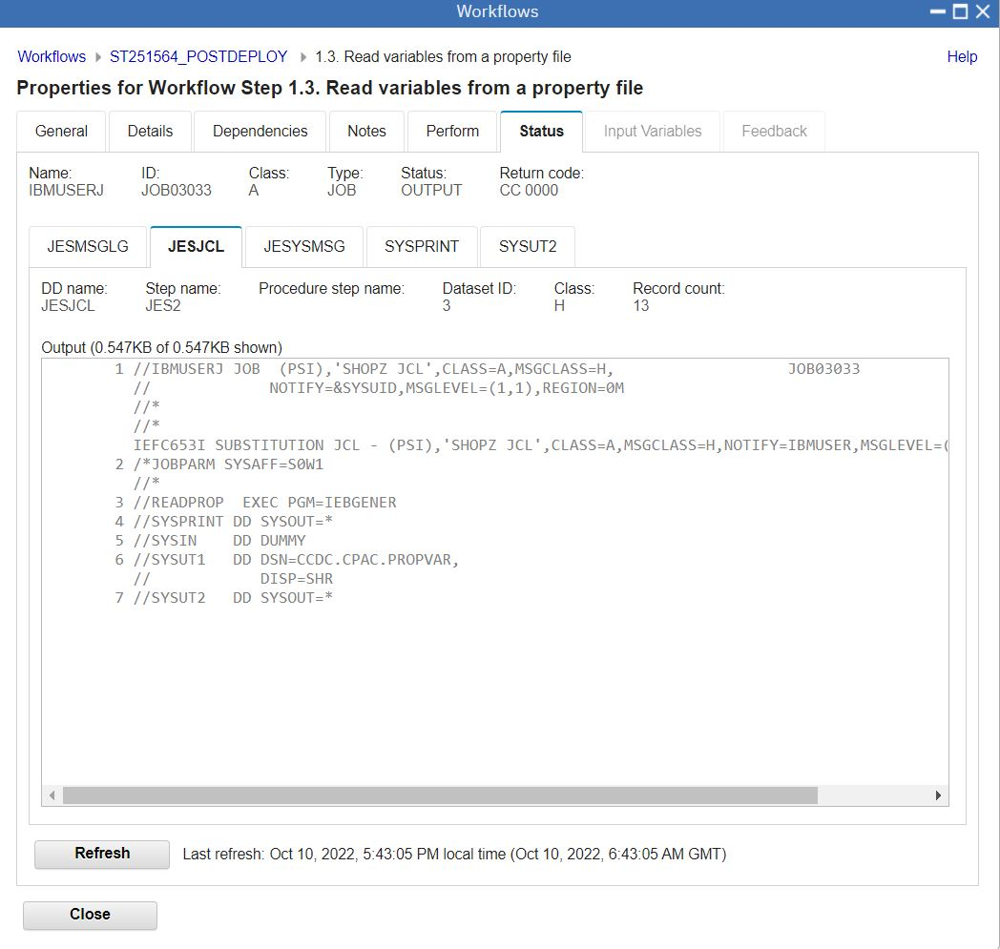

RACF Job doing a lot of stuff that I don't understand.

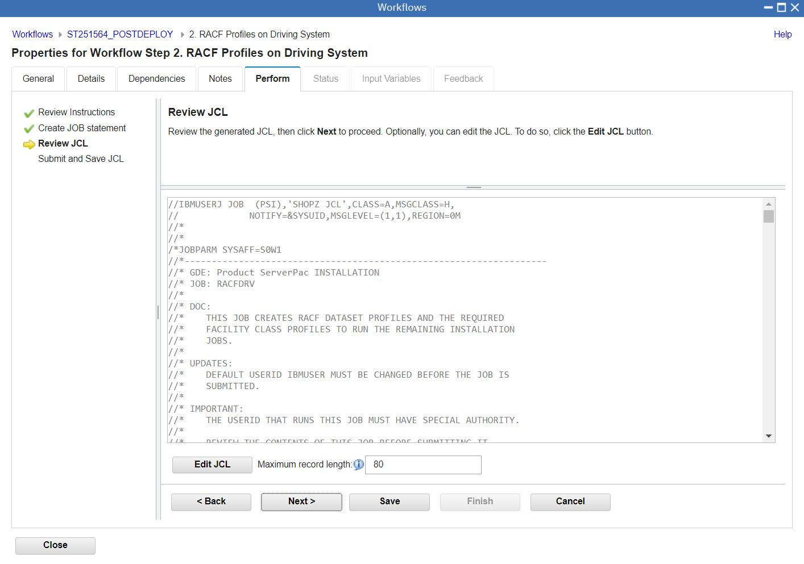

Runs fine, RC00, with lots of IBMUSER already has this power informational messages.

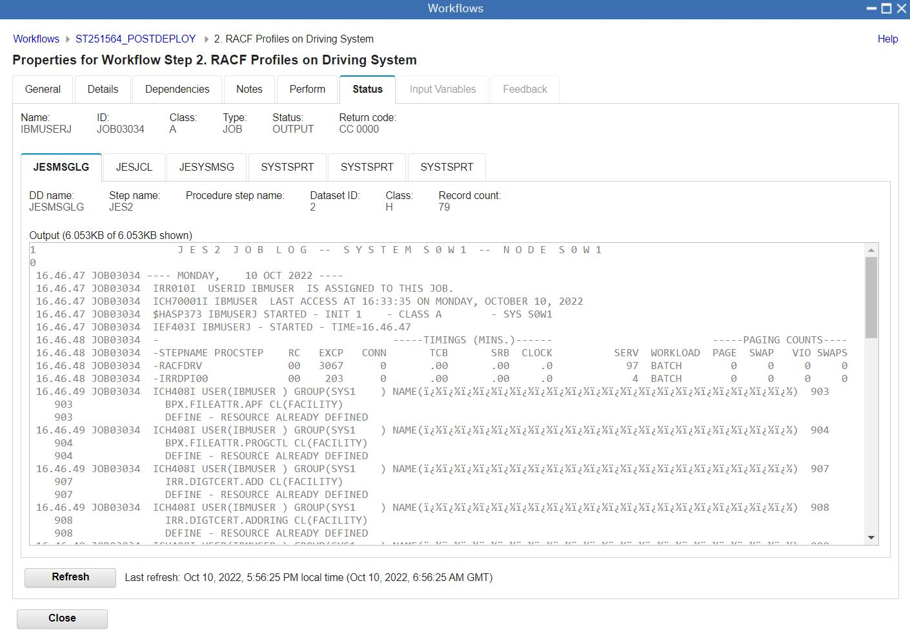

Job to update a subsystem PARMLIB.

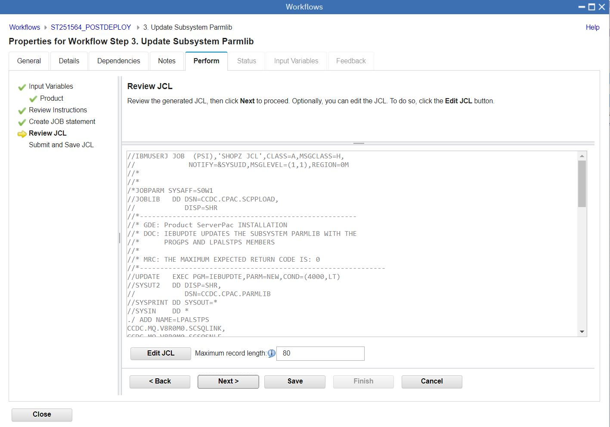 

Job to mount the filesystems for MQ.

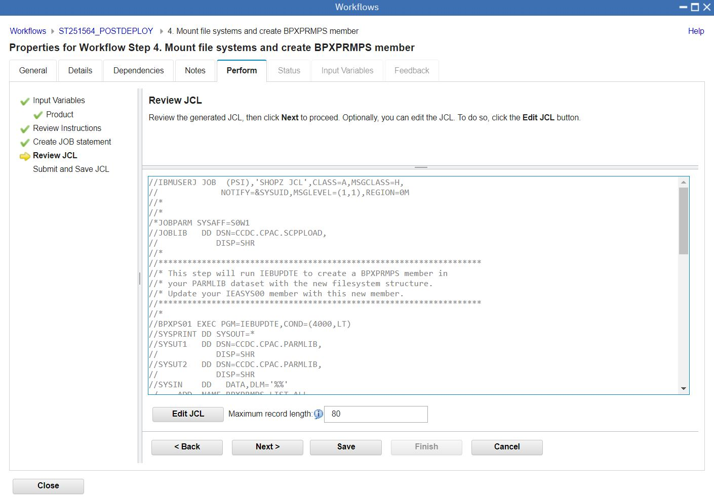

Job to Update the new SMPE DDDEFs.

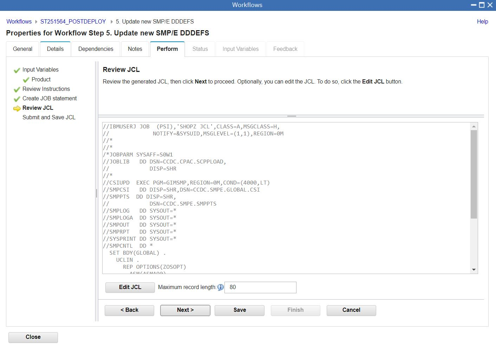

Job to Relink load modeules with CALLLIBs.

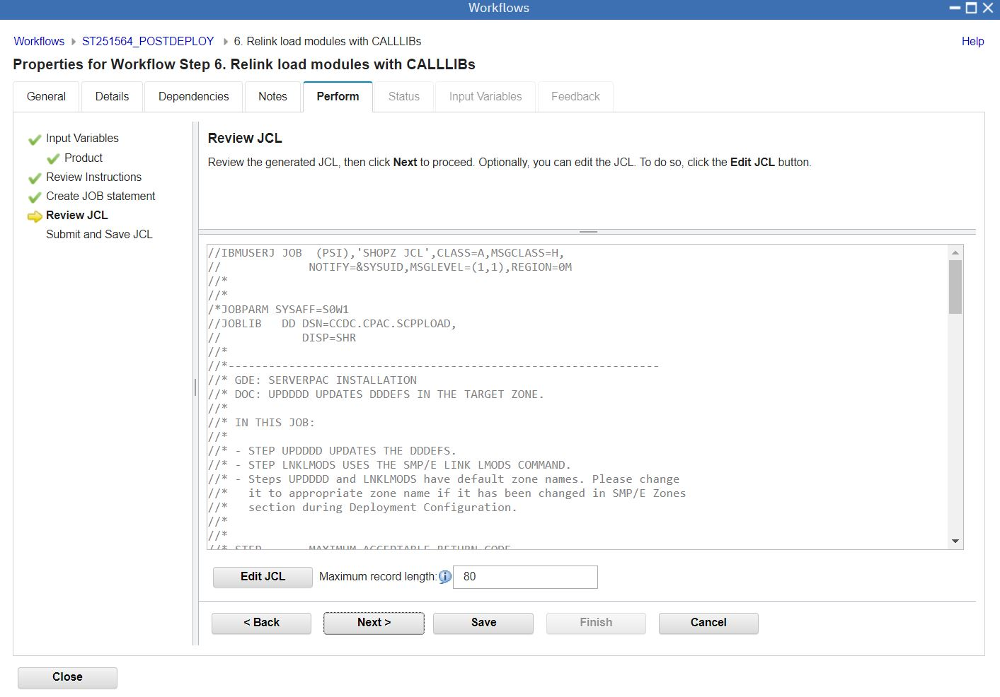

Job to Write Variables to a property file.

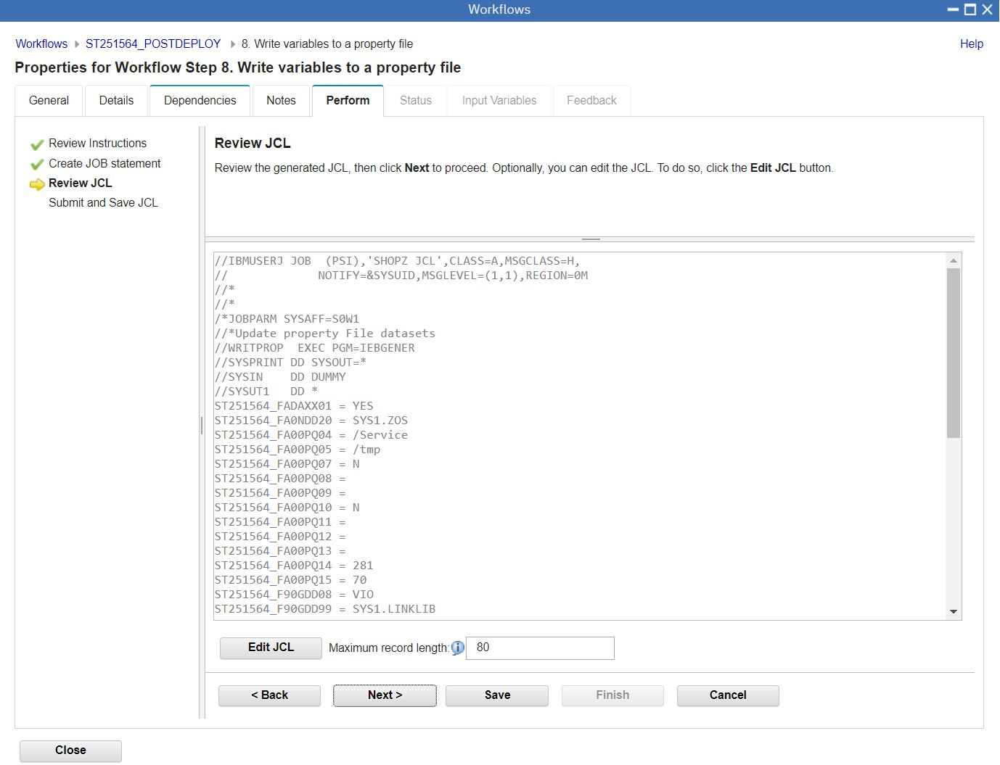


