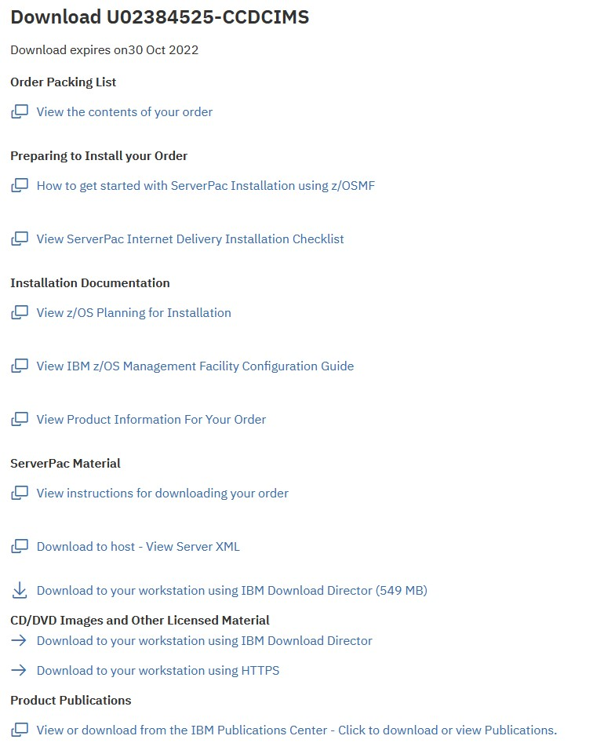
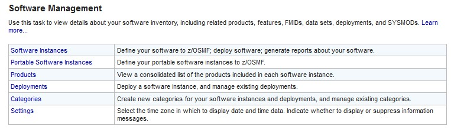
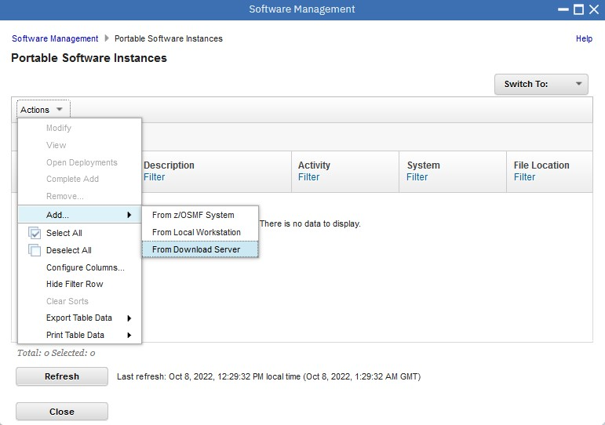

# Using z/OSMF to install a portable software instance from ShopZ

This is the hooli test sample.

1. Order the PSI Serverpac
2. Download the Serverpac to ZFS
3. Invoke the z/OSMF dialog to deploy the hooli PSI

## 1. Order a PSI Serverpac. ( Classic CDC for IMS )

Review the Download Package



Open the Server XML info, and copy the Server XML snippet to the clipboard.

```
=== Order Size and File System Size Information ========================
                                                                        
The size of your order is 549 MB                                        
                                                                        
You need space in the file system used by z/OSMF Software Management    
Add Portable Software Instance for approximately twice the size of your 
order. To convert to 3390 cylinders, multiply the number of MB by 1.25  
and then multiply by 2.                                                 
                                                                        
For example, for a size of 5000 MB, then:                               
( (5,000 MB) * (1.25 CYL/MB) ) * 2 = 12,500 cylinders                   
                                                                        
== Server XML for Add Portable Software Instance From Download Server ==
You can copy the below statements into the z/OSMF Software Management   
Server XML box.                                                         
                                                                        
<SERVER                                                                 
  host="deliverycb-mul.dhe.ibm.com"                                     
  user="P61f4395"                                                       
  pw="b8346803787q36r"                                                  
  >                                                                     
  <PACKAGE                                                              
      file="2022092900018/PROD/content/GIMPAF.XML"                      
      hash="000698051AF35E2A9B5307FD7E65B6CCE7C5542C"                   
      id="ST251564.content"                                             
   >                                                                    
  </PACKAGE>                                                            
</SERVER>      
```


## 2. Download the Serverpac to ZFS 

Open z/OSMF, and open Software Configuration.

```
https://192.168.1.191:10443/zosmf/ 
```

Choose "portable software instances"



Add from Download Server




## 3. Invoke the z/OSMF dialog to deploy the hooli PSI


