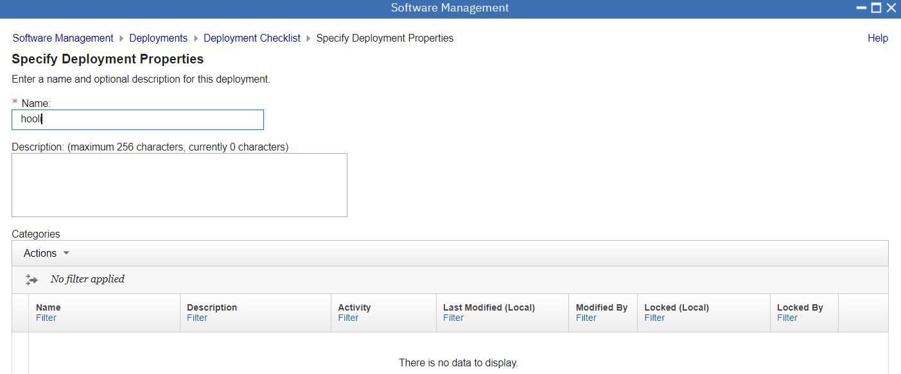

# Using z/OSMF to install a portable software instance from ShopZ

This is the hooli test sample.

1. Order the PSI Serverpac
2. Define the PSI and Download the Serverpac from ShopZ Download Server to ZFS
3. Invoke the z/OSMF Deployment dialog to deploy the hooli PSI

There is a series of videos covering the same material with detailed verbal explanation. 
The notes below are a scrollable summary for my own benefit.

https://mediacenter.ibm.com/playlist/dedicated/101043781/1_mzzf31vy/1_f1qhec1j


## 1. Order a PSI Serverpac. ( Classic CDC for IMS )

Review the Download Package


Open the Server XML info, and copy the Server XML snippet to the clipboard.

```
<SERVER
host="deliverycb-bld.dhe.ibm.com"
user="B0000000"
pw="123"
>
<PACKAGE
file="zosmf_pswi/GIMPAF.XML"
hash="4BDFCF518AB26E5DB3CB9F29F5505E3B2F62C28D"
id="pswitest.content"
>
</PACKAGE>
</SERVER>
```

and the CLIENT bits

```
<CLIENT
downloadmethod="https"
downloadkeyring="javatruststore"
>
</CLIENT>
```


## 2. Define the PSI and Download the Serverpac from ShopZ Download Server to ZFS 

Open z/OSMF, and open Software Configuration.

```
https://192.168.1.191:10443/zosmf/ 
```

Choose "portable software instances"


Add from Download Server


Fill in Page 1 details, including the <SERVER> XML
  

  
Next ... Fill in Page 2 details, including the <CLIENT> XML and a Job Card. Be careful to update the USS directory to what you want.
  


```
//IBMUSERJ JOB  (PSI),'SHOPZ JCL',CLASS=A,MSGCLASS=H,  
//             NOTIFY=&SYSUID,MSGLEVEL=(1,1),REGION=0M   
```
  
Next ... See the Download job generated in Page 3.
  

  
and verify it's location in ISPF  
  
  

You should submit the job via z/OSMF workload, so that it can track the end to end progress.  

    

Monitor the progress through z/OSMF ( refresh button )
  
    

View the Job progress in SDSF

    

And verify the download to ZFS via a terminal session
  
  

And on Page 4 press Finish
  
    
  

## 3. Invoke the z/OSMF dialog to deploy the hooli PSI

Now that the sucker is downloaded to a local ZFS, we need to complete various workflows. 
This is basically a browser user interface to control the SMPE processes that you would otherwise do with JCL, TSO, SMPE and ISPF.
  
Open the z/OSMF Deployments Page, and Start a New Deployment
  
     

You will see a worklow of tasks to perform through this z/OSMF workflow
  
    
 
  	
### 3.1 Specify the properties for this deployment.

Give the deployment a name
  
      
  
### 3.2 Select the software to deploy.

Choose the PSI you want to deploy
  
       
  
### 3.3 Select the objective for this deployment.

Tell it to create a new SMPE CSI (or place the PSI in an existing zone)
  
   
  
### 3.4 Check for Missing SYSMODs.

Optionally check for missing SYSMODs
  
   

### 3.5 Configure this deployment.

This is the SMPE stuff, all wrapped up in a browser dialog, which will be used to create a json file in the USS path. 
This json file contains a structured specification of all the steps, the DDDEFs the volumes or storage groups etc...  
  
     

Won't bother to screenshot every step, but the following notes cover the entries in the different pages
  
* welcome - press next
* DLIBS - YES, we do want to copy the DLIBs
* Model - Accept the Deployment Source as the model
* SMPE Zones - Accept names from model TGT + DLIB
* Datasets - Names, volumes, storage groups : select ALL ... modify all to control deployment (screenshot below)
* Catalogs - Accept CATALOG.Z25A.MASTER
* Volumes and Storage Classes - default
* Mount Points - /u/wallen/hooli - HOOLI.ZFS  (screenshot below)

  
Select all datasets and modify the desired HLQ and the desired volume or storage class   
     

Specify the eventual mount point ( but you need to do that outside PSI )  /u/wallen/hooli - HOOLI.ZFS  
      

### 3.6 Define the job settings. z/OSMF creates the deployment summary and jobs.

I was prompted to provide the storage class of generated jobs (SCBASE). 

  

Next, I am ready to ...   
  
#### 3.7 View the deployment summary.

remind myself what I specified
  
  
  
### 3.8 Submit deployment jobs.

Four jobs are generated.
* IZUD01RA	RACF Definitions: superflous for me : Override Complete
* IZUD02UZ	Unzip Data Sets: Run This
* IZUD03RN	Rename Data Sets: Run This
* IZUD04UC	Update CSI Data Sets: Run This  

    
  
  These jobs are saved to IBMUSER.DM.D221010.T131937.CNTL
  But run them from the z/OSMF workflow to keep track.
  
  The unzip job results in this
    
  
  The rename job results in this
    
  
  The CSI job just updates the CSI
  
  And the Deployment of datasets is complete.
      
  
### 3.8 Perform Workflows  

These workflows will contain some generic "how was it for you" questions, but may also contain some important customisation steps.
       
  
 About your order workflows is motherhood. Just click thru and read the docco..
        

 The User Interface is a bit asynchronous. Sometimes it takes a while to recognise a workflow step is complete.
  
 Finally we get to the real stuff. ( Mount ZFS and run IVP ).
     
  
 The workflow helpfully generates JCL job to run hooli.
     
  
 Save it to a PDS member. IBMUSER.CNTL(HOOLITST)
     
  
 Check it's there.
     
  
    Run the IVP Script from the workflow.
      
  
    And verify that all the "Perform Workflows" are complete.
      
  
### 3.9 Specify the properties for the target software instance.

  Finally - confirm properties of Hooli PSI 
      
  
  And we're done.
