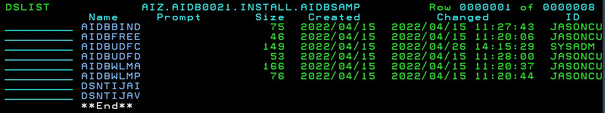

# SQL Data Insights

Beta 2.1.1
Db2 V12 Technology preview.

## USSFILES.ZFS

Create a Standard ZFS for holding pax files and matto files
To be permenantly mounted to hold USS files


```
//IBMUSERJ JOB  (NPA),'CREATE STD ZFS',CLASS=A,MSGCLASS=H,
//             NOTIFY=&SYSUID,MSGLEVEL=(1,1),REGION=0M    
//* JOB TO CREATE A STD ZFS                               
//DEFINE    EXEC   PGM=IDCAMS                             
//SYSPRINT  DD     SYSOUT=H                               
//SYSUDUMP  DD     SYSOUT=H                               
//AMSDUMP   DD     SYSOUT=H                               
//SYSIN     DD     *                                      
     DELETE 'USSFILES.ZFS'                                
     DEFINE CLUSTER (NAME(USSFILES.ZFS) -                 
            LINEAR -                                      
            TRACKS (1000 500) VOLUME(USER0A) -            
            DATACLASS(DCEXT) -                            
            SHAREOPTIONS(3))                              
/*                                                        
//FORMAT    EXEC  PGM=IOEAGFMT,REGION=0M,                 
// PARM=('-aggregate USSFILES.ZFS -compat')               
//SYSPRINT  DD     SYSOUT=H                               
//STDOUT    DD     SYSOUT=H                               
//STDERR    DD     SYSOUT=H                               
//SYSUDUMP  DD     SYSOUT=H                               
//CEEDUMP   DD     SYSOUT=H                               
//*                                                       
```

Permenantly Mount in **ADCD.Z25A.PARMLIB(BPXPRMDB)**

```
/* ----------------------------------------------------------------- */
/*                                                                   */
/* USSFILES ZFS                                                      */
/*                                                                   */
/* ----------------------------------------------------------------- */
                                                                       
MOUNT    FILESYSTEM('USSFILES.ZFS')                                    
         TYPE(ZFS)                                                     
         MODE(RDWR)                                                    
         MOUNTPOINT('/u/ibmuser/ussfiles')                             
```

Temporary Mount from ssh

mount -f USSFILES.ZFS /u/ibmuser/ussfiles

## SQLDI Beta211 Code

C:\Users\neale\code
```
-a----        15/07/2022  12:50 PM           7360 AIDB0211.IMAGE.AIDBDBRM.SEQ
-a----        15/07/2022  12:50 PM         325280 AIDB0211.IMAGE.AIDBLOAD.SEQ
-a----        06/07/2022   2:10 PM        3773360 AIDBSAMP.SEQ
-a----        15/06/2022  11:17 AM       38158848 aie_4-20-22.pax
-a----        15/06/2022  11:17 AM      319689216 sql-data-insights.pax
```

FTP the Pax Files

```
ftp 192.168.1.191
IBMUSER/SYS1
bin
put aie_4-20-22.pax /u/ibmuser/ussfiles/aie_4-20-22.pax
put sql-data-insights.pax /u/ibmuser/ussfiles/sql-data-insights.pax
```

ftp the PDS Images from Matto
```
ftp 192.168.1.191
IBMUSER/SYS1
Bin 
QUOTE SITE LRECL=80 RECFM=FB CYL PRI=5 SEC=1
put AIDB0211.IMAGE.AIDBDBRM.SEQ 'AIDB0211.IMAGE.AIDBDBRM.SEQ'
put AIDB0211.IMAGE.AIDBLOAD.SEQ 'AIDB0211.IMAGE.AIDBLOAD.SEQ'
put AIDBSAMP.SEQ 'AIDBSAMP.SEQ'
```

TSO Option 6 - Receive the PDS Images

```
RECEIVE INDA('AIDB0211.IMAGE.AIDBDBRM.SEQ')
DA('AIZ.AIDB0021.INSTALL.AIDBDBRM')
```


```
RECEIVE INDA('AIDB0211.IMAGE.AIDBLOAD.SEQ')
DA('AIZ.AIDB0021.INSTALL.AIDBLOAD')
```


```
RECEIVE INDA('AIDBSAMP.SEQ')
DA('AIZ.AIDB0021.INSTALL.AIDBSAMP')
```




