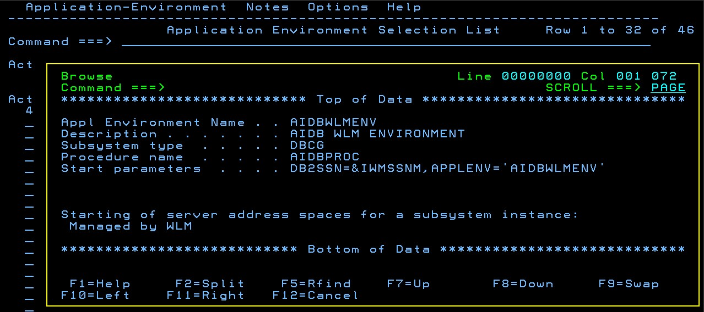
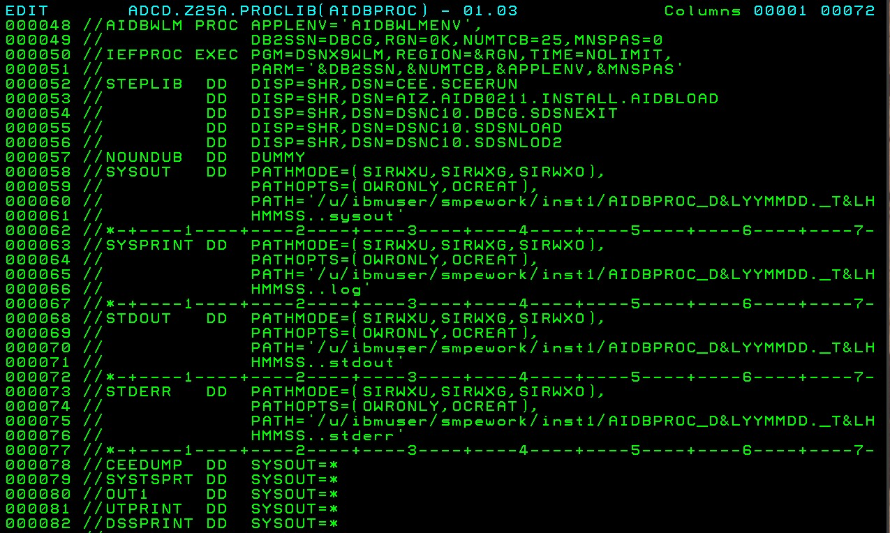

# SQL Data Insights

Beta 2.1.1
Db2 V12 Technology preview.

## USSFILES.ZFS

Create a Standard ZFS for holding pax files and matto files
To be permenantly mounted to hold USS files


```
//IBMUSERJ JOB  (NPA),'CREATE STD ZFS',CLASS=A,MSGCLASS=H,
//             NOTIFY=&SYSUID,MSGLEVEL=(1,1),REGION=0M    
//* JOB TO CREATE A STD ZFS                               
//DEFINE    EXEC   PGM=IDCAMS                             
//SYSPRINT  DD     SYSOUT=H                               
//SYSUDUMP  DD     SYSOUT=H                               
//AMSDUMP   DD     SYSOUT=H                               
//SYSIN     DD     *                                      
     DELETE 'USSFILES.ZFS'                                
     DEFINE CLUSTER (NAME(USSFILES.ZFS) -                 
            LINEAR -                                      
            TRACKS (1000 500) VOLUME(USER0A) -            
            DATACLASS(DCEXT) -                            
            SHAREOPTIONS(3))                              
/*                                                        
//FORMAT    EXEC  PGM=IOEAGFMT,REGION=0M,                 
// PARM=('-aggregate USSFILES.ZFS -compat')               
//SYSPRINT  DD     SYSOUT=H                               
//STDOUT    DD     SYSOUT=H                               
//STDERR    DD     SYSOUT=H                               
//SYSUDUMP  DD     SYSOUT=H                               
//CEEDUMP   DD     SYSOUT=H                               
//*                                                       
```

Permenantly Mount in **ADCD.Z25A.PARMLIB(BPXPRMDB)**

```
/* ----------------------------------------------------------------- */
/*                                                                   */
/* USSFILES ZFS                                                      */
/*                                                                   */
/* ----------------------------------------------------------------- */
                                                                       
MOUNT    FILESYSTEM('USSFILES.ZFS')                                    
         TYPE(ZFS)                                                     
         MODE(RDWR)                                                    
         MOUNTPOINT('/u/ibmuser/ussfiles')                             
```

Temporary Mount from ssh

mount -f USSFILES.ZFS /u/ibmuser/ussfiles

## SQLDI Beta211 Code

C:\Users\neale\code
```
-a----        15/07/2022  12:50 PM           7360 AIDB0211.IMAGE.AIDBDBRM.SEQ
-a----        15/07/2022  12:50 PM         325280 AIDB0211.IMAGE.AIDBLOAD.SEQ
-a----        06/07/2022   2:10 PM        3773360 AIDBSAMP.SEQ
-a----        15/06/2022  11:17 AM       38158848 aie_4-20-22.pax
-a----        15/06/2022  11:17 AM      319689216 sql-data-insights.pax
```

FTP the Pax Files

```
ftp 192.168.1.191
IBMUSER/SYS1
bin
put aie_4-20-22.pax /u/ibmuser/ussfiles/aie_4-20-22.pax
put sql-data-insights.pax /u/ibmuser/ussfiles/sql-data-insights.pax
```

ftp the PDS Images from Matto
```
ftp 192.168.1.191
IBMUSER/SYS1
Bin 
QUOTE SITE LRECL=80 RECFM=FB CYL PRI=5 SEC=1
put AIDB0211.IMAGE.AIDBDBRM.SEQ 'AIDB0211.IMAGE.AIDBDBRM.SEQ'
put AIDB0211.IMAGE.AIDBLOAD.SEQ 'AIDB0211.IMAGE.AIDBLOAD.SEQ'
put AIDBSAMP.SEQ 'AIDBSAMP.SEQ'
```

TSO Option 6 - Receive the PDS Images

```
RECEIVE INDA('AIDB0211.IMAGE.AIDBDBRM.SEQ')
DA('AIZ.AIDB0021.INSTALL.AIDBDBRM')
```


```
RECEIVE INDA('AIDB0211.IMAGE.AIDBLOAD.SEQ')
DA('AIZ.AIDB0021.INSTALL.AIDBLOAD')
```


```
RECEIVE INDA('AIDBSAMP.SEQ')
DA('AIZ.AIDB0021.INSTALL.AIDBSAMP')
```


## Users and Groups

Create a user AIDBADM. In a nutshell, you need to setup the following:
1. A RACF userid with an omvs segment to be the SQLDI instance owner.
2. which has generous CPU and Memory limits to reflect the fact that model training might take some time.
3. which is a member of a RACF group named SQLDIGRP.
4. and has USS environment settings that include PATH and LIBPATH values to link to all the Z AI libraries and the Deep Learning Compiler.

Copy **ADCD.JCL.LIB(ADDIDS)** to **IBMUSER.CNTL(ADDID)**

```
//IBMUSERJ JOB 'U','ADD NEW USERID',MSGCLASS=H,MSGLEVEL=(1,1),     
//         REGION=4M,TIME=1440,NOTIFY=&SYSUID,CLASS=A              
//**************************************************************** 
//*           THIS JOB needs to have caps off for OMVS seg       * 
//**************************************************************** 
//NEWID    EXEC PGM=IKJEFT01,DYNAMNBR=75,TIME=100,REGION=6M        
//SYSPRINT DD SYSOUT=*                                             
//SYSTSPRT DD SYSOUT=*                                             
//SYSTERM  DD DUMMY                                                
//SYSUADS  DD DSN=SYS1.UADS,DISP=SHR                               
//SYSLBC   DD DSN=SYS1.BRODCAST,DISP=SHR                           
//SYSTSIN  DD *                                                    
  AU AIDBADM NAME('AIDBADM') PASSWORD(AIDBADM)             -       
   OWNER(SYS1) DFLTGRP(SYS1) UACC(READ) OPERATIONS SPECIAL   -     
   TSO(ACCTNUM(ACCT#) PROC(DBSPROCC) JOBCLASS(A) MSGCLASS(X) -     
      HOLDCLASS(X) SYSOUTCLASS(X) SIZE(4048) MAXSIZE(0))     -     
    OMVS(HOME(/u/aidbadm) PROGRAM(/bin/sh) UID(1111))                 
  PERMIT ACCT#     CLASS(ACCTNUM) ID(AIDBADM)                      
  PERMIT ISPFPROC  CLASS(TSOPROC) ID(AIDBADM)                      
  PERMIT DBSPROC   CLASS(TSOPROC) ID(AIDBADM)                      
  PERMIT JCL       CLASS(TSOAUTH) ID(AIDBADM)                      
  PERMIT OPER      CLASS(TSOAUTH) ID(AIDBADM)                      
  PERMIT ACCT      CLASS(TSOAUTH) ID(AIDBADM)                      
  PERMIT MOUNT     CLASS(TSOAUTH) ID(AIDBADM)                      
  AD 'AIDBADM.*'  OWNER(AIDBADM) UACC(READ) GENERIC                
  SETROPTS REFRESH RACLIST(TSOPROC)                                
LOGOFF                                                             
```

Logon and chnage password to SYS1.

Edit OMVS properties of AIDBADM


Display properties of AIDBADM


Edit **/u/aidbadm/.profile**

```
#export JAVA_HOME=/usr/lpp/java/J8.0_64
export _BPXK_AUTOCVT=ON
#export PATH=$PATH:/apps/zospt/bin:/usr/lpp/java/J8.0_64/bin
#export TR_Options="noResumableTrapHandler"
alias db2="java com.ibm.db2.clp.db2"
CLPHOME=/usr/lpp/db2c10/base
PATH=$PATH:/apps/zospt/bin:/usr/lpp/java/J8.0_64/bin
PATH=/usr/lpp/db2c10/jdbc/bin:$PATH
export PATH
export LIBPATH=/usr/lpp/db2c10/jdbc/lib:$LIBPATH
CLASSPATH=$CLASSPATH:/usr/lpp/db2c10/base/classes:$CLPHOME/lib/clp.jar
CLASSPATH=$CLASSPATH:/usr/lpp/db2c10/jdbc/classes/db2jcc4.jar
CLASSPATH=$CLASSPATH:/usr/lpp/db2c10/jdbc/classes/db2jcc_javax.jar
CLASSPATH=$CLASSPATH:/usr/lpp/db2c10/jdbc/classes/sqlj4.zip
CLASSPATH=$CLASSPATH:/usr/lpp/db2c10/jdbc/classes/db2jcc_license_cisuz.jar
export CLASSPATH
# ZOAU Requirements
export ZOAU_HOME=/usr/lpp/IBM/zoautil
export PATH=${ZOAU_HOME}/bin:$PATH
#ZOAU MAN
export MANPATH=${ZOAU_HOME}/docs/%L:$MANPATH
export CLASSPATH=${ZOAU_HOME}/lib/*:${CLASSPATH}
export LIBPATH=${ZOAU_HOME}/lib:${LIBPATH}
# IBM Python - Ansible Supported
export PATH=/usr/lpp/IBM/cyp/v3r9/pyz/bin:$PATH
export PYTHONPATH=/usr/lpp/IBM/cyp/v3r9/pyz
export PYTHONPATH=${PYTHONPATH}:${ZOAU_HOME}/lib

echo "Setup for SQL Data Insights Beta 2.11"

export JAVA_HOME=/usr/lpp/java/J8.0_64
export SQLDI_INSTALL_DIR=/u/ibmuser/smpework
export ZADE_INSTALL_DIR=/u/ibmuser/smpework/aie/zade
export ZAIE_INSTALL_DIR=/u/ibmuser/smpework/aie
export BLAS_INSTALL_DIR=/u/ibmuser/smpework/aie/blas
export SPARK_HOME=$SQLDI_INSTALL_DIR/spark24x

#PATH
PATH=/bin:$PATH
PATH=$SQLDI_INSTALL_DIR/sql-data-insights/bin:$PATH
PATH=$SQLDI_INSTALL_DIR/tools/bin:$PATH
PATH=$ZADE_INSTALL_DIR/bin:$PATH
PATH=$PATH:$JAVA_HOME/bin
export PATH=$PATH

#LIBPATH
LIBPATH=/lib:/usr/lib
LIBPATH=$LIBPATH:$JAVA_HOME/bin/classic
LIBPATH=$LIBPATH:$JAVA_HOME/bin/j9vm
LIBPATH=$LIBPATH:$JAVA_HOME/lib/s390x
LIBPATH=$LIBPATH:$SPARK_HOME/lib
LIBPATH=$BLAS_INSTALL_DIR/lib:$LIBPATH
LIBPATH=$ZAIE_INSTALL_DIR/zade/lib:$LIBPATH
LIBPATH=$ZAIE_INSTALL_DIR/zdnn/lib:$LIBPATH
LIBPATH=$ZAIE_INSTALL_DIR/zaio/lib:$LIBPATH
export LIBPATH=$LIBPATH

# Other system environment variables
export IBM_JAVA_OPTIONS="-Dfile.encoding=UTF-8"
export _BPXK_AUTOCVT=ON
export _BPX_SHAREAS=NO
export _ENCODE_FILE_NEW=ISO8859-1
export _ENCODE_FILE_EXISTING=UNTAGGED
export _CEE_RUNOPTS="FILETAG(AUTOCVT,AUTOTAG) POSIX(ON)"
```

Create SQLDI Group and Add Members **IBMUSER.CNTL(SQLDIGRP)**

```
//IBMUSERJ JOB  (NPA),'CREATE SQLDIGRP',CLASS=A,MSGCLASS=H,
//             NOTIFY=&SYSUID,MSGLEVEL=(1,1),REGION=0M     
//* JOB TO CREATE SQLDI GROUP                              
//S1       EXEC PGM=IKJEFT01                               
                                                           
//SYSTSPRT DD SYSOUT=*                                     
                                                           
//SYSPRINT DD SYSOUT=*                                     
                                                           
//SYSTSIN  DD *                                            
                                                           
ADDGROUP SQLDIGRP OMVS(AUTOGID) OWNER(IBMUSER)             
                                                           
CONNECT (AIDBADM) GROUP(SQLDIGRP) OWNER(IBMUSER)           
                                                           
CONNECT (IBMUSER) GROUP(SQLDIGRP) OWNER(IBMUSER)           
                                                           
SETROPTS RACLIST(FACILITY) REFRESH                         
                                                           
/*                                                         
```


## Mount a Large ZFS

Check mounted filesystems with command d omvs,f**


temporarily use SMPEWORK.ZFS mounted at /u/ibmuser/smpework 


## Install the AI libaries and SQLDI

mkdir /u/ibmuser/smpework/aie

cd/u/ibmuser/smpework/aie

pax -r -ppx -f /u/ibmuser/ussfiles/aie_4-20-22.pax

```
AIDBADM:/u/ibmuser/smpework/aie: >pax -r -ppx -f /u/ibmuser/ussfiles/aie_4-20-22.pax
AIDBADM:/u/ibmuser/smpework/aie: >ls -al
total 112
drwxr-xr-x   7 AIDBADM  SYS1        8192 Mar 24 09:30 .
drwxrwxrwx   3 OMVSKERN SYS1        8192 Aug 25 03:36 ..
drwxr-xr-x   4 AIDBADM  SYS1        8192 Mar 24 13:28 blas
drwxr-xr-x   2 AIDBADM  SYS1        8192 Apr 20 13:37 mvs
drwxr-xr-x   4 AIDBADM  SYS1        8192 Apr 20 13:38 zade
drwxr-xr-x   4 AIDBADM  SYS1        8192 Apr 20 13:34 zaio
drwxr-xr-x   4 AIDBADM  SYS1        8192 Mar 24 09:27 zdnn
```


cd /u/ibmuser/smpework

pax -r -ppx -f /u/ibmuser/ussfiles/sql-data-insights.pax

```
AIDBADM:/u/ibmuser/smpework: >pax -r -ppx -f /u/ibmuser/ussfiles/sql-data-insights.pax
AIDBADM:/u/ibmuser/smpework: >ls -al
total 112
drwxrwxrwx   7 OMVSKERN SYS1        8192 Aug 25 03:39 .
drwxr-xr-x  14 OMVSKERN SYS1        8192 Aug 25 03:14 ..
drwxr-xr-x   7 AIDBADM  SYS1        8192 Mar 24 09:30 aie
drwxr-xr-x  12 AIDBADM  SYS1        8192 Apr 14 01:52 spark24x
drwxr-xr-x   6 AIDBADM  SYS1        8192 Apr 14 01:52 sql-data-insights
drwxr-xr-x   3 AIDBADM  SYS1        8192 Apr 11 01:15 templates
drwxr-xr-x   3 AIDBADM  SYS1        8192 Apr 11 01:15 tools
```

Step 3: RACF Keyring
Run **IBMUSER.CNTL(RACFKR00)**

```
//S1       EXEC PGM=IKJEFT01                                      
//SYSTSPRT DD SYSOUT=*                                            
//SYSPRINT DD SYSOUT=*                                            
//SYSTSIN  DD *                                                   
                                                                  
RACDCERT ADDRING(WMLZRING) ID(AIDBADM)                            
                                                                  
RACDCERT GENCERT CERTAUTH +                                       
SUBJECTSDN( +                                                     
      CN('STLAB41') +                                             
      C('US') +                                                   
      SP('CA') +                                                  
      L('SAN JOSE') +                                             
      O('IBM') +                                                  
      OU('WMLZ') +                                                
) +                                                               
ALTNAME( +                                                        
      EMAIL('NMARION@US.IBM.COM') +                               
) +                                                               
WITHLABEL('WMLZCACERT') +                                         
NOTAFTER(DATE(2024/01/01))                                        
                                                                  
RACDCERT GENCERT ID(AIDBADM) +                                    
SUBJECTSDN( +                                                     
      CN('STLAB41') +                                             
      C('US') +                                                   
      SP('CA') +                                                  
      L('SAN JOSE') +                                             
      O('IBM') +                                                     
      OU('WMLZ') +                                                   
) +                                                                  
ALTNAME( +                                                           
      EMAIL('NMARION@US.IBM.COM') +                                  
) +                                                                  
WITHLABEL('WMLZCERT_WMLZID') +                                       
SIGNWITH(CERTAUTH LABEL('WMLZCACERT')) +                             
NOTAFTER(DATE(2024/01/01))                                           
                                                                     
RACDCERT ID(AIDBADM) CONNECT(CERTAUTH LABEL('WMLZCACERT') +          
RING(WMLZRING))                                                      
                                                                     
RACDCERT ID(AIDBADM) CONNECT(ID(AIDBADM) LABEL('WMLZCERT_WMLZID') +  
RING(WMLZRING) USAGE(PERSONAL))                                      
                                                                     
PERMIT IRR.DIGTCERT.LISTRING CLASS(FACILITY) ID(AIDBADM) ACCESS(READ)
PERMIT IRR.DIGTCERT.LISTRING CLASS(FACILITY) ID(USER1) ACCESS(READ)  
                                                                     
SETROPTS RACLIST(FACILITY) REFRESH                                   
                                                                     
/*                                                                         
```

Run **IBMUSER.CNTL(RACFVIEW)**

```
//S1       EXEC PGM=IKJEFT01                        
//SYSTSPRT DD SYSOUT=*                              
//SYSPRINT DD SYSOUT=*                              
//SYSTSIN  DD *                                     
                                                    
RACDCERT LISTRING(WMLZRING) ID(AIDBADM)             
                                                    
RACDCERT CERTAUTH LIST(LABEL('WMLZCACERT'))         
                                                    
RACDCERT LIST(LABEL('WMLZCERT_WMLZID')) ID(AIDBADM) 
                                                    
/*                                                  
```

Step 4: Create the Db2 artefacts

For all jobs
* DBCG
* DSNC10.SDSNLOAD
* DSNC10.DBCG.RUNLIB.LOAD
* DSNC10.DBCG.SDSNEXIT
* DSNTEP12

Create Pseudo Catalog with **AIZ.AIDB0211.INSTALL.AIDBSAMP(DSNTIJAI)**


Create UDFs with **AIZ.AIDB0211.INSTALL.AIDBSAMP(AIDBUDFC)**

Note that
1. The LOAD modules in **AIZ.AIDB0211.INSTALL.AIDBLOAD** need to be referenced by the PROC
2. The PROC will be **ADCD.Z25A.PROCLIB(AIDBPROC)**
3. The WLM Environment **AIDBWLMENV** needs to be defined in WLM, and activated

example below

```
//SYSIN    DD *                                          
                                                         
  CREATE FUNCTION SYSFUN.AI_SIMILARITY(                  
                    MLCOL1 VARCHAR(128),                 
                    VALUE1 VARCHAR(1868),                
                    MLCOL2 VARCHAR(128),                 
                    VALUE2 VARCHAR(1868),                
                    SCHEMA VARCHAR(128),                 
                    TABNAM VARCHAR(128))                 
    RETURNS DOUBLE                                       
    EXTERNAL NAME SIMIUDF                                
    LANGUAGE C                                           
    PARAMETER STYLE DB2SQL                               
    PARAMETER CCSID UNICODE                              
    PARAMETER VARCHAR NULTERM                            
    PROGRAM TYPE SUB                                     
    SCRATCHPAD 20480                                     
    NO FINAL CALL                                        
    WLM ENVIRONMENT AIDBWLMENV                           
    SECURITY DB2                                         
    READS SQL DATA                                       
    COLLID SIMIUDF                                       
    ALLOW PARALLEL                                       
    NOT DETERMINISTIC                                    
    RETURNS NULL ON NULL INPUT                           
    STAY RESIDENT YES                                    
    NO EXTERNAL ACTION                                   
    RUN OPTIONS 'POSIX(ON),XPLINK(ON),ENVAR("AISTRC=00")'
  ;                                                      
```

Create with **AIZ.AIDB0211.INSTALL.AIDBSAMP(AIDBBIND)**


Step 5: Check **SYSPROC.DSNUTILU**

The WLM is **DBCGENVU** defined and points to PROCNAME **DBCGWLMU**


And the PROC exists in PROCLIB


```
D WLM,APPLENV=EBCGENVU
```


Step 6 : Setup WLM & PROC for the UDFs

Define the WLM **AIDBWLMENV**


Check it 



Create the PROCLIB Member

Create **ADCD.Z25A.PROCLIB(AIDBPROC)** and customize the JCL. 


```
V WLM,POLICY=ETPBASE

D WLM,APPLENV=AIDBWLMENV
```

Step 7: Install SQLDI Instance


```
AIDBADM:/u/ibmuser/smpework: >df -k /u/ibmuser/smpework
Mounted on     Filesystem                Avail/Total    Files      Status
/u/ibmuser/smpework (SMPEWORK.ZFS)            2014887/2401920 4294966000 Available


ibmuser@192.168.1.191's password:
IBMUSER:/u/ibmuser: >zfsadm grow -aggregate SMPEWORK.ZFS -size 5000000
IOEZ00173I Aggregate SMPEWORK.ZFS successfully grown
SMPEWORK.ZFS (R/W COMP): 4613007 K free out of total 5000400

AIDBADM:/u/ibmuser/smpework: >df -k /u/ibmuser/smpework
Mounted on     Filesystem                Avail/Total    Files      Status
/u/ibmuser/smpework (SMPEWORK.ZFS)            4613007/5000400 4294966000 Available

```

zfsadm grow -aggregate SMPEWORK.ZFS -size 5000000


sqldi.sh create

Enter the keyring name: WMLZRING

Enter the keyring owner: AIDBADM

Enter certificate label: WMLZCert_WMLZID


Test:
sqldi.sh start_spark
sqldi.sh start
Open the SQLDI Web UI https://172.20.64.16:15001
Add Connection
Enable AI for CHURN
Query


## Debugging

Testing by Training Q.CIMATE_USA
600 rows * 6 columns

Test SQL

```
  SELECT * FROM
   (SELECT C.*,
       SYSFUN.AI_SIMILARITY('STATE', STATE,
       'STATE', 'CA', 'Q', 'CLIMATE_USA') AS SIMILARITY
    FROM Q.CLIMATE_USA C
    WHERE STATE <> 'CA')
  WHERE SIMILARITY > 0.5
  ORDER BY SIMILARITY DESC
  FETCH FIRST 20 ROWS ONLY;
  ```

Get Error
```
DB2 SQL Error: SQLCODE=-471, SQLSTATE=55023, SQLERRMC=SYSFUN.AI_SIMILARITY;00E7900C, DRIVER=4.31.10
```

WLM Definition points to subsystem type (DB2) - not subsystem id (DBCG)
Doh...


Fix this

```
RDEFINE SERVER DB2.DBCG.AIDBWLMENV UACC(NONE)
PERMIT DB2.DBCG.AIDBWLMENV CL(SERVER) ID(START1) ACCESS(READ)
SETROPTS RACLIST(SERVER) REFRESH
```
