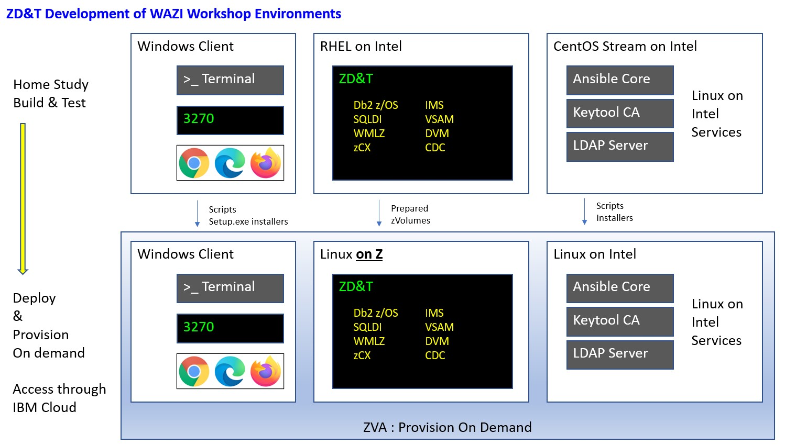

# System Design Overview

Build on ZPDT ; Export to ZVA.

## z/OS on P52

192.168.1.191
IBMUSER/SYS1 (DBSPROCC)
DBCG – DALLASC - 5040
 
## Upcoming Priorities

ANZ Bank
CDC for Db2 ( Kafka Channel Demo)

zForum
1. SQLDI V12
2. DVM & VSAM & IMS for SQLDI
3. DDF REST 
4. Jupyter & Anaconda from Windows
5. Export to ZVA

Andrew SICA
1. TensorFlow Serving
2. WMLZ
3. WMLZ Community Serving
4. NNPA Test Harness

Support Zeditor
1. Z Data Visibility narrative
