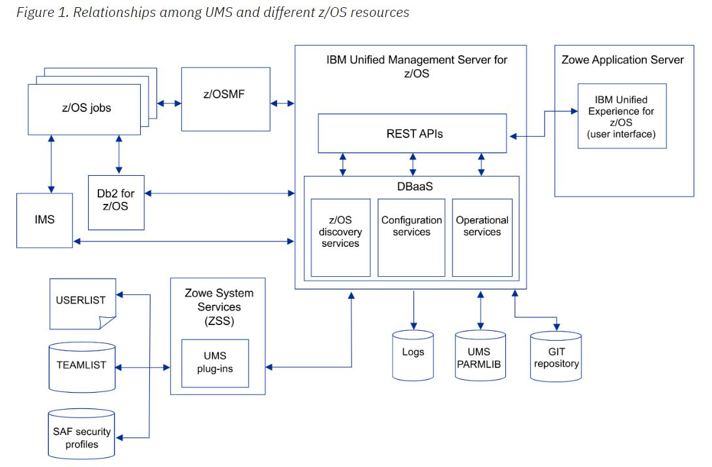

# UMS PSI

## Download PSI from ShopZ

Server XML
```
<SERVER                                                                 
  host="deliverycb-mul.dhe.ibm.com"                                     
  user="P84298B0"                                                       
  pw="k979321D955927p"                                                  
  >                                                                     
  <PACKAGE                                                              
      file="2022092900025/PROD/content/GIMPAF.XML"                      
      hash="D39FE9C82984ED98F58A4AAEDEC05A89B4B1A7A7"                   
      id="ST251562.content"                                             
   >                                                                    
  </PACKAGE>                                                            
</SERVER>   
```

ZFS

```
/u/ibmuser/smpework/ums
```

Watch the files come down

```
IBMUSER:/u/ibmuser/smpework/ums: >ls -al
total 1264
drwxrwxr-x   2 OMVSKERN SYS1        8192 Oct 10 04:49 .
drwxrwxrwx   8 OMVSKERN SYS1        8192 Oct 10 04:48 ..
-rw-rw-rw-   1 OMVSKERN SYS1         405 Oct 10 04:49 CPYRIGHT
-rw-rw-rw-   1 OMVSKERN SYS1       25440 Oct 10 04:49 GIMPAF.XML
-rw-rw-rw-   1 OMVSKERN SYS1       20732 Oct 10 04:49 IZUD00DF.json
-rw-rw-rw-   1 OMVSKERN SYS1       32256 Oct 10 04:49 S0003.CB.ST251562.CPAC.DB2.PARMLIB.pax.Z
-rw-rw-rw-   1 OMVSKERN SYS1      225792 Oct 10 04:49 S0004.CB.ST251562.CPAC.PDFPD.pax.Z
-rw-rw-rw-   1 OMVSKERN SYS1      282432 Oct 10 04:49 S0005.CB.ST251562.CPAC.PROD.PDF.pax.Z
IBMUSER:/u/ibmuser/smpework/ums: >
```


## Documentation 

https://www.ibm.com/docs/en/umsfz/1.1.0?topic=110-installation

UMS Architecture



Hardware Requirements
* 18 GB memory
* 2 GB disk

Software Requirements
* IBM z/OS 2.3 or later.
* IBM z/OS Integrated Cryptographic Service Facility (ICSF) must be installed and configured with a token data set (TKDS) and the ICSF started task started, as described in the z/OS Cryptographic Services ICSF: System Programmer's Guide.
* IBM z/OS Management Facility (z/OSMF) (version is same as z/OS version). For information, see the z/OSMF documentation.
* IBM Resource Access Control Facility (RACF®) or another equivalent external security manager that supports z/OS system authorization facility (SAF) interface.
* Refer to the following table for the required Zowe version for each PTF. ( zowe v1.25 for UMS )
